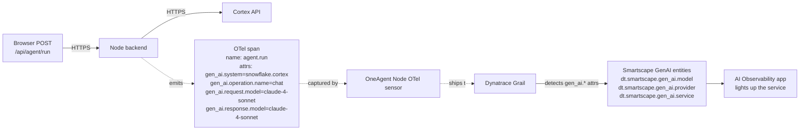

# FieldOps Copilot — Azure + Full-Stack OneAgent Demo

End-to-end observability demo for a field-service AI agent on **Azure**, instrumented entirely by **Dynatrace OneAgent**, with a swappable Snowflake Cortex Agents client (mock today, real later).

The full plan and rationale live in [docs/Cortex_Agent_Azure_OneAgent_Demo_Plan.md](docs/Cortex_Agent_Azure_OneAgent_Demo_Plan.md). Build state is tracked in `.github/agents/` (the sub-agents that built this) and `.github/skills/` (the contracts they obey).

## Repo layout

```
infra/      # Terraform — Azure VM, NSG, cloud-init
backend/    # Node/Express + SSE; OTel tool spans; mock and Snowflake clients
frontend/   # Static SPA with manual RUM tag (auto-injection fallback)
scripts/    # up.sh / down.sh / deploy.sh — one-command bring-up/teardown
dashboards/ # FieldOps observability dashboard (dtctl-managed)
docs/       # The plan
.github/    # Sub-agents, skills, repo instructions
```

## Quick local check (mock mode, no Azure)

```bash
cd backend && npm install --omit=dev
AGENT_MODE=mock node server.js
# in another shell:
curl -N -X POST http://127.0.0.1:8000/api/agent/run \
  -H 'content-type: application/json' \
  -d '{"prompt":"Show overdue work orders","role":"technician"}'
```

Open [frontend/index.html](frontend/index.html) directly in a browser — the built-in simulator runs offline if the backend isn't reachable.

## How Dynatrace knows this is a GenAI service

Dynatrace does **not** sniff outbound traffic and recognize `*.snowflakecomputing.com` as "Snowflake Cortex". It does not pattern-match URLs, ports, or payloads. The classification is **100% driven by OpenTelemetry GenAI semantic-convention attributes that the backend code puts on the spans.**

The browser doesn't make the Cortex call — it POSTs to `/api/agent/run`, and the Node backend makes the outbound HTTPS call. So Dynatrace's GenAI detection happens on the **backend service**, not in the browser.



The four trigger attributes on any span emitted by the service:

| Attribute | Our value | What it tells Dynatrace |
|---|---|---|
| `gen_ai.system` | `snowflake.cortex` | The provider/system |
| `gen_ai.operation.name` | `chat` | Chat-style LLM operation (vs `embeddings`, `completion`) |
| `gen_ai.request.model` | `claude-4-sonnet` | Which model was requested |
| `gen_ai.response.model` | `claude-4-sonnet` | Which model actually responded |

When the ingest pipeline sees these on a span, it derives the three Smartscape GenAI entities (model, provider, service) and links them to the parent `dt.entity.service`. The AI Observability app queries by those entities — that's why `fieldops-backend` shows up in its AI Services list with `claude-4-sonnet` as a model version.

The "Prompt trace" panel additionally reads OTel **span events** (`gen_ai.user.message`, `gen_ai.choice`) for the input/output columns. Attribute-based `gen_ai.prompt` / `gen_ai.completion` feed DQL and the token chart, but the panel itself uses events per the OTel GenAI semantic conventions.

### Why we set the attrs manually

Two paths exist for getting `gen_ai.*` onto spans:

1. **SDK auto-instrumentation** — the official OpenAI / Anthropic / LangChain / LiteLLM OTel instrumentations emit `gen_ai.*` automatically. OneAgent's Node sensor inherits these without extra work.
2. **Manual instrumentation** — when a provider has no first-class OTel SDK (Cortex Agents is a plain REST endpoint today), wrap the call in a span yourself and set the attributes. That's what [backend/server.js](backend/server.js) does.

Either path produces identical telemetry. The semantic conventions are the contract — Cortex, OpenAI, Bedrock, Vertex, custom-hosted Llama: the AI Observability wiring is provider-agnostic.

## Deploy to Azure (one command)

Prereqs: `terraform`, `az` (logged in via `az login`), `ssh`, `curl`, a Dynatrace PaaS token with scope `InstallerDownload`.

```bash
# Token only ever lives in your shell env — never in a file, never in chat.
read -rs 'TF_VAR_dt_paas_token?Paste PaaS token: ' && export TF_VAR_dt_paas_token
./scripts/up.sh
```

What [scripts/up.sh](scripts/up.sh) does:
1. Verifies prereqs and Azure login.
2. Generates `~/.ssh/fieldops_rsa` if missing (azurerm rejects ed25519).
3. Auto-syncs your current public IP into `infra/terraform.tfvars`.
4. `terraform apply` — creates RG, VNet, NSG, public IP, VM.
5. SSHes in and runs [scripts/deploy.sh](scripts/deploy.sh) — installs OneAgent, Node 20, Nginx, clones the app, starts the systemd service. Idempotent.
6. Smoke test: confirms 200 on the frontend and an SSE stream from the backend.
7. Prints the URL, SSH command, and dashboard link.

Total time: ~5 minutes.

```bash
./scripts/down.sh   # tears down all Azure resources when you're done
```

`down.sh` removes the resource group (and everything in it). Dynatrace tenant resources (dashboard, web application) survive across up/down cycles — see comments in the script for manual cleanup if needed.

### Why cloud-init isn't the deploy path
The plan's Section 6 uses cloud-init for deploy. In practice on Sprint with the canonical Ubuntu image we saw cloud-init's `runcmd` partially execute (typically the first `apt` step ran and subsequent steps didn't), leaving the VM bare. `scripts/deploy.sh` runs the same logic over SSH and is idempotent, so it's the reliable path. cloud-init remains in `infra/cloud-init.yaml` as the documented intent but the SSH script is what guarantees the state.

## After the customer is sold — Snowflake-side observability follow-up

The app-side trace stops at our `tool.cortex_*` spans. To stitch in Snowflake's internal query spans, Cortex telemetry from Snowflake Trail, and per-query credit attribution, deploy:

- **[dynatrace-oss/dynatrace-snowflake-observability-agent (DSOA)](https://github.com/dynatrace-oss/dynatrace-snowflake-observability-agent)** — runs as Snowflake tasks inside the customer's account, pushes telemetry to Dynatrace.

Recommended plugins for the Cortex story (skip the rest):

| Plugin | What it adds |
|---|---|
| `event_log` | Snowflake Trail → OTel spans with Snowtrail `trace_id`/`span_id`. Cortex internals land here. |
| `query_history` (with `query_cost_attribution: true`) | Every Cortex-Analyst-issued SQL as a span with attributed compute credits. |
| `metering` | Credit consumption broken down by service type (`AI_SERVICES` separates Cortex from raw warehouse). |
| `active_queries` | 5-min fresh feed of running queries — strong demo moment. |

**Join key**: `snowflake.request_id` is already stamped on our `agent.run` span. The same UUID appears on Snowflake's query records (when passed via the Cortex Agents `request_id` parameter), making the cross-system stitch a one-line DQL `join`.

Setup requires `ACCOUNTADMIN` and burns warehouse credits on its plugin schedules — not for the demo itself, just for the post-sale rollout.

## Eval follow-up

The `gen_ai.prompt`, `gen_ai.completion`, and `gen_ai.context` attributes on `agent.run` and `tool.*` spans are populated for [dynatrace-oss/dt-evals](https://github.com/dynatrace-oss/dt-evals) compatibility. Run evaluators against live spans with:

```bash
npx @dynatrace-oss/dt-evals doctor
npx @dynatrace-oss/dt-evals run --since 1h --metric faithfulness
```

The OneAgent attribute allow-list (plan section 9.2) must include those three attributes, plus `gen_ai.response_id`, before evals will work.
