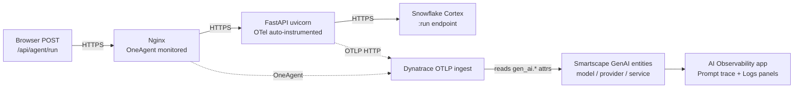

# FieldOps Copilot — Azure + OneAgent + OpenLLMetry Demo

End-to-end Dynatrace observability demo for a field-service AI agent on **Azure**, calling **Snowflake Cortex Agents**. The backend is **Python (FastAPI + sse-starlette)** with a swappable Cortex client (mock today, real Snowflake when credentials are provided). Telemetry comes from two complementary stacks pointed at the **same Dynatrace tenant**:

- **Dynatrace OneAgent** on the VM — host, Nginx, RUM, system logs, infrastructure metrics. Excluded from the Python process group via the [PG monitoring exclusion](#why-the-uvicorn-process-group-is-excluded-from-oneagent-deep-monitoring) so it doesn't double-publish the AI service entity.
- **OpenLLMetry / Traceloop → OTLP** from the Python process — `gen_ai.*` spans + OTLP logs that light up the Dynatrace **AI Observability** app (prompts, completions, tokens, tool breakdown, trace stitch).

The full architecture plan lives in [docs/Cortex_Agent_Azure_OneAgent_Demo_Plan.md](docs/Cortex_Agent_Azure_OneAgent_Demo_Plan.md). The roadmap to a complete-demo state is in [docs/Cortex_Agent_Complete_Demo_Plan.md](docs/Cortex_Agent_Complete_Demo_Plan.md).

---

## Repo layout

```
infra/      # Terraform — Azure VM, NSG
backend/    # Python FastAPI + Traceloop OTLP; mock and Snowflake clients
frontend/   # Static SPA with manual RUM tag; CRLF-tolerant SSE parser
scripts/    # up.sh / down.sh / deploy.sh — one-command lifecycle
dashboards/ # FieldOps observability dashboard (dtctl-managed)
docs/       # Plan + roadmap
.github/    # Sub-agents, skills, repo instructions
```

---

## Quick local check (mock mode, no Azure)

```bash
cd backend
python3.11 -m venv .venv && source .venv/bin/activate
pip install -r requirements.txt
AGENT_MODE=mock uvicorn server:app --host 127.0.0.1 --port 8000
# in another shell:
curl -N -X POST http://127.0.0.1:8000/api/agent/run \
  -H 'content-type: application/json' \
  -d '{"prompt":"Show overdue work orders","role":"technician"}'
```

Or open [frontend/index.html](frontend/index.html) directly in a browser — the built-in simulator runs offline if the backend isn't reachable.

---

## How Dynatrace knows this is a GenAI service

Dynatrace does **not** sniff outbound traffic and recognize `*.snowflakecomputing.com` as "Snowflake Cortex". It does not pattern-match URLs, ports, or payloads. The classification is **100% driven by OpenTelemetry GenAI semantic-convention attributes that the backend code puts on the spans**, shipped via OTLP by [Traceloop / OpenLLMetry](https://github.com/traceloop/openllmetry).

The browser doesn't make the Cortex call — it POSTs to `/api/agent/run`, and the Python backend makes the outbound HTTPS call. So Dynatrace's GenAI detection happens on the **backend service**, not in the browser.



### The GenAI attributes the AI Obs panel reads

Per the OTel GenAI semantic-convention **v1.36+**, the AI Observability app reads prompts and completions from attribute-based JSON messages — **not** from the older `gen_ai.user.message` / `gen_ai.choice` span events.

| Attribute | Our value | What it tells Dynatrace |
|---|---|---|
| `gen_ai.system` / `gen_ai.provider.name` | `snowflake.cortex` | Provider identity → Smartscape GenAI provider entity |
| `gen_ai.operation.name` | `chat` | Operation type (vs `embeddings`, `completion`) |
| `gen_ai.agent.name` | `fieldops-supervisor` | Agent label in the AI Obs Explorer |
| `gen_ai.request.model` | `$CORTEX_MODEL` (default `claude-3-5-sonnet`) | Model requested |
| `gen_ai.response.model` | from Cortex response, overrides request value | Model **actually used** by Snowflake's agent definition |
| `gen_ai.is_streaming` | `true` | We stream via SSE |
| `gen_ai.input.messages` | `[{"role":"user","parts":[{"type":"text","content":"..."}]}]` | **Drives the "Input" prompt in the AI Obs Prompt trace panel** |
| `gen_ai.output.messages` | `[{"role":"assistant","parts":[{"type":"text","content":"..."}],"finish_reason":"stop"}]` | **Drives the "Assistant" output in the Prompt trace panel** |
| `gen_ai.usage.input_tokens` / `output_tokens` / `total_tokens` | from Cortex usage block | Powers the token chart |
| `gen_ai.response.id` / `gen_ai.response.finish_reasons` | from Cortex response | Run identification, completion status |

> **Important**: each `parts[]` item **must** include `"type": "text"` (or `"tool_call"`, etc.). Without it the panel labels the message as "Unknown" instead of "Input" / "Assistant".

Legacy `gen_ai.prompt` / `gen_ai.completion` / `gen_ai.context` attributes are still emitted for [dt-evals](https://github.com/dynatrace-oss/dt-evals) compatibility and for the custom DQL dashboard tiles.

### Why we set the attributes manually

Traceloop's Python SDK auto-instruments common LLM clients (OpenAI, Anthropic, LangChain, LlamaIndex, Bedrock, Vertex) and emits `gen_ai.*` automatically — drop in `Traceloop.init()` and the attrs land for free.

Snowflake Cortex Agents has no first-class OTel SDK (it's a plain REST + SSE endpoint), so we wrap the call in an `agent.run` span and set the attributes ourselves in [backend/server.py](backend/server.py). Same telemetry shape, just hand-written.

---

## Trace structure

One user request produces **one trace** that stitches across services:

```
nginx :80 POST /api/agent/run               (OneAgent, SERVER)
  └── POST /api/agent/run                   (FastAPI/OTel, SERVER, kind detected from inbound trace context)
        └── agent.run                       (our OTel, INTERNAL)
              ├── tool.cortex_analyst       (our OTel, INTERNAL) — or tool.cortex_search
              └── (HTTPS to Cortex)         (httpx — not instrumented yet, see Phase 1 in the roadmap)
```

Spans land on the OTLP service entity `fieldops-backend`. The Nginx hop lives on `OneAgent` (its own service `:80`) and is linked via W3C `traceparent` context propagated between layers.

The AI Obs Logs tab populates because **logs ship via OTLP** through an OTel `LoggingHandler` attached to the root logger (in [backend/otel_init.py](backend/otel_init.py)). Application messages, FastAPI/uvicorn access/error logs, and any library log line flow to the same `dt.entity.service` as the spans, with `trace_id` and `span_id` auto-injected.

---

## Why the uvicorn process group is excluded from OneAgent deep monitoring

When OneAgent and an OTLP SDK both run in the same Python process pointed at the same tenant, OneAgent's codemodule observes the OTel spans and **republishes** them under its own service identity — you end up with **two `fieldops-backend` entries** in the AI Obs Services list, both with the same gen_ai data. (See the [OneAgent + OpenLLMetry coexistence skill](.github/skills/dynatrace-oneagent-otel/SKILL.md).)

[scripts/deploy.sh](scripts/deploy.sh) handles this for you in two ways:

1. **`DT_INJECT=false`** in the systemd EnvironmentFile — prevents LD_PRELOAD-style injection on the Python process.
2. **`builtin:process-group.monitoring.state = MONITORING_OFF`** is applied via `dtctl create settings ... --scope PROCESS_GROUP-<uvicorn-pg-id>` — prevents OneAgent's auto-attach daemon (which can re-attach even without LD_PRELOAD).

OneAgent stays fully installed for Nginx, host metrics, RUM injection, and journald log capture — only the Python AI process is excluded.

For a customer in production, this same pattern applies: either exclude the AI app PG, or accept that the service may appear twice.

---

## Deploy to Azure (one command)

Prereqs: `terraform`, `az` (logged in), `ssh`, `curl`.

| Env var | Purpose |
|---|---|
| `DT_INFRA_URL` | Base URL of the Dynatrace tenant (e.g. `https://abc.live.dynatrace.com`). Drives OneAgent install + apps UI links. |
| `DT_OTLP_ENDPOINT` | OTLP endpoint (defaults to `$DT_INFRA_URL/api/v2/otlp` → single-tenant deploy). Set explicitly only if you want OTLP to ship to a **different** tenant than OneAgent. |
| `TF_VAR_dt_paas_token` | PaaS token on `DT_INFRA_URL`, scope `InstallerDownload` |
| `DT_API_TOKEN` | API token on `DT_OTLP_ENDPOINT`, scopes `openTelemetryTrace.ingest` + `logs.ingest` |
| `DT_DASHBOARD_ID` (optional) | Dashboard UUID to include in the final summary output |
| `CORTEX_MODEL` (optional) | Model identifier surfaced on `gen_ai.request.model` (default `claude-3-5-sonnet`). When `AGENT_MODE=snowflake`, `gen_ai.response.model` is overridden with whatever Snowflake's response carries. |

Any value not in env is **prompted for at runtime** — tokens are never written to disk.

```bash
./scripts/up.sh
# answer the prompts (token-generation URLs are derived from your tenant URL and shown above each prompt)
```

[scripts/up.sh](scripts/up.sh) does:
1. Prompts / verifies tenant URLs and tokens; derives apps-UI URLs.
2. Verifies prereqs and Azure login (probes an ARM access token to catch MFA-expired sessions before terraform).
3. Generates `~/.ssh/fieldops_rsa` if missing (azurerm rejects ed25519).
4. Auto-syncs your current public IP into `infra/terraform.tfvars`.
5. `terraform apply` — creates RG, VNet, NSG, public IP, VM.
6. SSHes in and runs [scripts/deploy.sh](scripts/deploy.sh) — installs OneAgent, Python 3.11, Nginx; clones the app; builds a venv; writes `/etc/fieldops/backend.env`; applies the PG monitoring exclusion; starts the systemd service. Idempotent.
7. Smoke test: 200 on the frontend + SSE event stream from the backend.
8. Prints URL, SSH command, and AI Obs app link.

Total time: ~5 minutes.

```bash
./scripts/down.sh   # tears down all Azure resources when you're done
```

`down.sh` removes the resource group (and everything in it). Dynatrace tenant resources (dashboard, web application, PG settings) survive across up/down cycles.

### Why cloud-init isn't the deploy path
The plan's Section 6 describes cloud-init. In practice cloud-init's `runcmd` partially executes on canonical Ubuntu (typically only the first `apt` step), leaving the VM bare. `scripts/deploy.sh` runs the same logic over SSH and is idempotent, so it's the reliable path. cloud-init remains in `infra/cloud-init.yaml` as documented intent.

---

## Switching from mock to live Snowflake Cortex

Default is `AGENT_MODE=mock` (canned scenarios so the demo works without a Snowflake account). To run against a real Cortex agent, populate `/etc/fieldops/backend.env` on the VM:

```
AGENT_MODE=snowflake
CORTEX_HOST=<account>.snowflakecomputing.com
CORTEX_DATABASE=SNOWFLAKE_INTELLIGENCE
CORTEX_SCHEMA=AGENTS
CORTEX_AGENT=<agent_name>
CORTEX_PAT=<programmatic access token>
CORTEX_MODEL=<optional; leave unset to let the agent decide>
```

Then `systemctl restart fieldops-backend`. The swappable-client pattern means no code changes — the [`SnowflakeCortexClient`](backend/agent/snowflake_client.py) is already wired and yields the same canonical SSE events as the mock.

See [docs/Cortex_Agent_Complete_Demo_Plan.md](docs/Cortex_Agent_Complete_Demo_Plan.md) **Phase 2** for the end-to-end procedure (semantic model, Cortex Search service, agent creation, acceptance criteria).

---

## What's on the dashboard

[dashboards/fieldops-dashboard.json](dashboards/fieldops-dashboard.json) (deployed to id `7105baa7-5608-465e-874e-69c1ae0781e2`):

| Tile | Query |
|---|---|
| 1. Agent requests by role | `agent.run` timeseries split by `user.role` |
| 2. Agent latency p50 / p90 / p99 | `agent.run` duration percentiles |
| 3. Tool duration & call count by tool | `tool.cortex_*` p50/p95/calls |
| 4. Tokens in vs out by role | `gen_ai.usage.input_tokens` / `output_tokens` sums |
| 5. Host CPU usage | OneAgent infra |
| 6. Recent conversations | table — prompt, completion, tokens, request_id |
| 7. Agent / tool log lines (OTLP) | logs filtered by `service.name`, content match |
| 8. FastAPI HTTP server latency | `POST /api/agent/run` SERVER span p50/p90 |
| 9. Total tokens per minute | `gen_ai.usage.total_tokens` sum |

All span tiles are scoped to `dt.service.name == "fieldops-backend"` (the OTLP service entity). The logs tile uses `service.name` (the field name on log records is different from spans).

---

## Eval follow-up — dt-evals

The `gen_ai.prompt`, `gen_ai.completion`, and `gen_ai.context` attributes on `agent.run` and `tool.*` spans are populated for [dynatrace-oss/dt-evals](https://github.com/dynatrace-oss/dt-evals) compatibility. Run evaluators against live spans with:

```bash
uvx dt-evals doctor
uvx dt-evals run --since 1h --metric faithfulness
```

No OneAgent attribute allow-list is needed when shipping via OTLP — Dynatrace stores all OTLP span attributes by default.

---

## After the customer is sold — Snowflake-side observability

The app-side trace stops at our outbound HTTPS call to Cortex. To bring **Cortex's internal execution, the warehouse SQL Analyst ran, and per-query credit attribution** into the same Dynatrace tenant, deploy:

- **[dynatrace-oss/dynatrace-snowflake-observability-agent (DSOA)](https://github.com/dynatrace-oss/dynatrace-snowflake-observability-agent)** — runs as Snowflake tasks inside the customer's account, pushes telemetry to Dynatrace.

Recommended plugins for the Cortex story:

| Plugin | What it adds |
|---|---|
| `event_log` | Snowflake Trail → OTel spans with Snowtrail `trace_id`/`span_id`. Cortex internals land here. |
| `query_history` (with `query_cost_attribution: true`) | Every Cortex-Analyst-issued SQL as a span with attributed compute credits. |
| `metering` | Credit consumption broken down by service type (`AI_SERVICES` separates Cortex from raw warehouse). |
| `active_queries` | 5-min fresh feed of running queries — strong demo moment. |

**Cross-system join key**: `snowflake.request_id` is already stamped on every `agent.run` span. The same UUID will appear on Snowflake's `query_history` records when passed via the Cortex `:run` body — see [Phase 4 of the complete-demo plan](docs/Cortex_Agent_Complete_Demo_Plan.md#phase-4--cross-system-trace-stitch-xs-depends-on-phase-3).

Setup requires `ACCOUNTADMIN` and burns warehouse credits on plugin schedules — appropriate post-sale, not for the demo itself.

---

## Roadmap (the gaps that remain)

See [docs/Cortex_Agent_Complete_Demo_Plan.md](docs/Cortex_Agent_Complete_Demo_Plan.md) for the full plan with acceptance criteria. The condensed version:

| # | Gap | Effort |
|---|---|---|
| 1 | No CLIENT span for the outbound HTTPS to Cortex (add `opentelemetry-instrumentation-httpx`) | XS |
| 2 | `AGENT_MODE=mock` only — run against a real Cortex account | M |
| 3 | Zero visibility inside Cortex execution — deploy DSOA in customer's Snowflake | L |
| 4 | No app↔warehouse trace stitch yet — pass `snowflake.request_id` on `:run` | XS (depends on #3) |
| 5 | Production polish — auth, vault, scaling, resilience | mandatory for any customer pilot |
