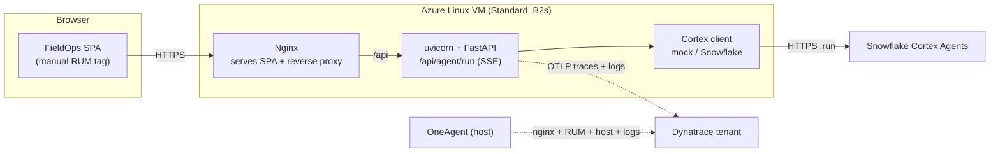

# FieldOps Copilot — Azure + OneAgent + OpenLLMetry Demo Plan

End-to-end observability demo for a field-service AI agent, provisioned on **Azure with Terraform**, with a **Python (FastAPI) backend** calling **Snowflake Cortex Agents**. Telemetry comes from two complementary stacks pointed at the same Dynatrace tenant:

- **Dynatrace OneAgent** on the VM → host, Nginx, RUM, system logs, infrastructure metrics.
- **OpenLLMetry (Traceloop) → OTLP** from the Python process → `gen_ai.*` spans + OTLP logs that light up Dynatrace's **AI Observability** app (prompts, completions, tokens, tool breakdown, trace stitch).

The agent layer is a swappable mock today that emits the exact Cortex Agents SSE event shapes, so pointing it at a real Snowflake Cortex Agent later is a one-file change.

Roadmap to a complete-demo state (live Cortex, DSOA, cross-system stitch): see [Cortex_Agent_Complete_Demo_Plan.md](Cortex_Agent_Complete_Demo_Plan.md).

---

## 1. What the customer sees

- A real **distributed trace** from the browser (RUM) → Nginx → FastAPI → `agent.run` → each tool call (`tool.cortex_analyst` / `tool.cortex_search`), stitched end-to-end on the same `trace.id`.
- **RUM**: user actions, sessions, and frontend timing — OneAgent serves the SPA and the page carries a manual RUM tag.
- **Logs** from the FastAPI app and uvicorn, shipped via OTLP and bound to the same `dt.entity.service` as the spans → AI Observability **Logs** tab populates.
- **AI Observability app**: `fieldops-backend` shows up as an AI Service with model, token usage, and a per-prompt **Prompt trace** panel showing the user input and assistant completion.
- **Custom dashboard**: agent request rate by role, latency percentiles, tool duration, token trend, FastAPI HTTP latency, recent conversations table, OTLP log table, host CPU.
- A believable field-service story (work orders, pump stations, asset manuals) matching a typical Cortex customer.

---

## 2. Architecture



Two streams, one tenant. The uvicorn process group has OneAgent deep monitoring **disabled** so OneAgent doesn't double-publish the AI service entity — explained in [Section 9](#9-step-4--oneagent--otel-coexistence).

---

## 3. Stack rationale: why OneAgent + OpenLLMetry, why Python

**Why both stacks**

OneAgent for Python doesn't have an LLM SDK auto-instrumentation module. It auto-instruments Flask/FastAPI/Django at the HTTP level, but the `gen_ai.*` semantic-convention attributes that Dynatrace's AI Observability app reads are **not** emitted automatically. To populate AI Obs, the application has to emit OTel spans with the right attributes itself — and the canonical Python path for that is the [Traceloop / OpenLLMetry](https://github.com/traceloop/openllmetry) SDK or manual OTel SDK usage with the OTLP HTTP exporter.

Meanwhile, OneAgent on the host gives infrastructure, Nginx service detection, RUM injection, and journald log capture — all things the OTel SDK doesn't provide.

So we use both, pointed at the same tenant.

**Why Python**

A real customer building on Cortex Agents almost certainly uses Python — Snowflake's SDKs (`snowflake-snowpark-python`, `snowflake-connector-python`), their Cortex quickstarts, Streamlit-in-Snowflake, and dt-evals are all Python-first. Building the demo in Python matches the realistic customer architecture.

**The coexistence cost**

When OneAgent's codemodule and an OTLP SDK report the same process to the same tenant, OneAgent observes the SDK's spans and republishes them under its own service identity → you get **two `fieldops-backend` entries** in the AI Obs Services list. The mitigation, applied automatically by [scripts/deploy.sh](../scripts/deploy.sh), is to set `DT_INJECT=false` on the Python process **and** create a `builtin:process-group.monitoring.state = MONITORING_OFF` setting scoped to the uvicorn process group. Both are needed: `DT_INJECT` blocks LD_PRELOAD; the PG setting blocks OneAgent's auto-attach daemon from re-attaching.

OneAgent stays fully installed for everything else (host, Nginx, RUM, journald).

---

## 4. Repo layout

```
fieldops-demo/
├── infra/
│   ├── main.tf
│   ├── variables.tf
│   ├── outputs.tf
│   └── cloud-init.yaml          # documented intent; scripts/deploy.sh is the reliable path
├── backend/
│   ├── server.py                # FastAPI + sse-starlette + manual GenAI semconv
│   ├── otel_init.py             # Traceloop init + OTLP logs handler
│   ├── agent/
│   │   ├── base.py              # canonical SSE event names
│   │   ├── mock_client.py       # field-service mock (today)
│   │   └── snowflake_client.py  # real Cortex REST client
│   ├── requirements.txt
│   └── fieldops-backend.service # systemd unit (EnvironmentFile=/etc/fieldops/backend.env)
├── frontend/
│   └── index.html               # SPA with CRLF-tolerant SSE parser + offline simulator
├── scripts/
│   ├── up.sh                    # one-command Azure bring-up
│   ├── down.sh                  # one-command teardown
│   └── deploy.sh                # runs on the VM via SSH from up.sh
├── dashboards/
│   └── fieldops-dashboard.json
└── docs/
    ├── Cortex_Agent_Azure_OneAgent_Demo_Plan.md         # this file
    └── Cortex_Agent_Complete_Demo_Plan.md                # roadmap to customer-shaped demo
```

---

## 5. Prerequisites

- Azure subscription + `az login` (Sales-Engineering/NORAM or equivalent).
- Terraform ≥ 1.6.
- `dtctl` installed (`brew install dynatrace-oss/tap/dtctl`).
- Two Dynatrace tokens (any not in env are prompted for at runtime by `scripts/up.sh`):
  - **PaaS / installer token** — scope `InstallerDownload`. Used for the OneAgent install on the VM.
  - **API token** — scopes `openTelemetryTrace.ingest`, `logs.ingest`. Used by the Python process to ship OTLP. (Both can live on the same tenant — `up.sh` defaults `DT_OTLP_ENDPOINT` to `$DT_INFRA_URL/api/v2/otlp`.)
  - **dtctl auth** — separate OAuth login for managing the dashboard.
- The Dynatrace tenant URL, e.g. `https://<env>.live.dynatrace.com`.
- An SSH RSA public key (azurerm rejects ed25519) and your current public IP — `scripts/up.sh` generates the key if missing and auto-syncs the IP.

---

## 6. Step 1 — Terraform infrastructure

Files under `infra/`:

- **`main.tf`** — RG, VNet, subnet, public IP (static), NSG (SSH + HTTP from your IP only), NIC, Linux VM `Standard_B2s` (Ubuntu 22.04). Provider `azurerm ~> 3.110`.
- **`variables.tf`** — `prefix`, `location`, `vm_size`, `admin_username`, `ssh_public_key`, `allowed_ip`, `dt_environment_url`, `dt_paas_token` (sensitive).
- **`outputs.tf`** — `public_ip`, `url`.
- **`cloud-init.yaml`** — documents the install intent. In practice `runcmd` partially executes on canonical Ubuntu (typically only the first `apt` step), so the reliable path is `scripts/deploy.sh` run over SSH after the VM comes up. cloud-init is preserved for reference.

`scripts/up.sh` runs `terraform init` + `terraform apply -auto-approve` and produces `public_ip` / `url`.

---

## 7. Step 2 — Python backend

Backend lives under `backend/`. Three top-level files and an `agent/` package.

### `backend/requirements.txt`

Pin tight enough to keep Traceloop/OTel SDK versions compatible:

```
fastapi==0.115.4
uvicorn[standard]==0.32.0
sse-starlette==2.1.3
httpx==0.27.2
httpx-sse==0.4.0
pydantic==2.9.2
traceloop-sdk==0.30.1
opentelemetry-exporter-otlp-proto-http==1.27.0
opentelemetry-instrumentation-fastapi==0.48b0
```

### `backend/otel_init.py` (imported first by `server.py`)

- Reads `DT_OTLP_ENDPOINT`, `DT_API_TOKEN`, `OTEL_SERVICE_NAME` (default `fieldops-backend`).
- Initializes Traceloop with an `OTLPSpanExporter` pointed at `${DT_OTLP_ENDPOINT}/v1/traces`.
- Creates an `OTLPLogExporter` pointed at `${DT_OTLP_ENDPOINT}/v1/logs`, wires it through a `LoggerProvider` with `Resource{service.name=fieldops-backend}`, and attaches an `OTel LoggingHandler` to the **root** logger so FastAPI, uvicorn (access + error), our app, and any library that uses `logging` ships to OTLP.
- Adds a `StreamHandler(sys.stdout)` as defense in depth so logs remain visible in journald during ssh-based debugging.

### `backend/agent/base.py`

Canonical SSE event names — same string values the frontend parser and the mock and Snowflake clients all share. Locked by [.github/skills/cortex-agent-protocol/SKILL.md](../.github/skills/cortex-agent-protocol/SKILL.md):

```python
EVENTS = SimpleNamespace(
    STATUS="response.status",
    THINKING="response.thinking",
    TOOL_USE="response.tool_use",
    TOOL_RESULT="response.tool_result",
    TABLE="response.table",
    TEXT_DELTA="response.text.delta",
    DONE="response",
    ERROR="error",
)
```

### `backend/agent/mock_client.py`

Async generator with two canned scenarios selected by regex on the prompt:

- **data**: `cortex_analyst` → SQL → 3-row table → answer
- **knowledge**: `cortex_search` → hits → asset-manual answer

The mock's `DONE` event yields `model: "claude-3-5-sonnet"` so the response-model-override path is exercised end-to-end in mock mode too.

### `backend/agent/snowflake_client.py`

Async generator wrapping `httpx.AsyncClient` + `httpx-sse.aconnect_sse` against `https://<host>/api/v2/databases/<db>/schemas/<schema>/agents/<agent>:run`. Headers:
```
Authorization: Bearer <CORTEX_PAT>
X-Snowflake-Authorization-Token-Type: PROGRAMMATIC_ACCESS_TOKEN
Content-Type: application/json
Accept: text/event-stream
```
Body includes `messages` always; `model` only if `CORTEX_MODEL` env is set (otherwise the agent's own Snowflake-side configuration decides).

A `normalize(ev, data)` adapter translates Cortex wire-shape variants (`searchResults[]` → `hits` count, `rowType+data` → `columns+rows`, `usage.{prompt,completion}_tokens` → `tokens_in/tokens_out`, top-level or `metadata.model` → `model` on DONE) so `server.py` never sees Snowflake-specific field names.

### `backend/server.py` (the GenAI semconv core)

Key shape:

```python
import otel_init  # FIRST — sets tracer provider + OTel log handler
import json, logging, os, uuid
from fastapi import FastAPI
from pydantic import BaseModel
from sse_starlette.sse import EventSourceResponse
from opentelemetry import trace
from opentelemetry.trace import SpanKind
from opentelemetry.instrumentation.fastapi import FastAPIInstrumentor

from agent.base import EVENTS
from agent.mock_client import MockCortexClient
from agent.snowflake_client import SnowflakeCortexClient

tracer = trace.get_tracer("fieldops-copilot")
app = FastAPI()
FastAPIInstrumentor().instrument_app(app)   # HTTP server span; reads inbound traceparent

CORTEX_MODEL_DEFAULT = os.environ.get("CORTEX_MODEL", "claude-3-5-sonnet")
log = logging.getLogger("fieldops")


def _client():
    return SnowflakeCortexClient() if os.environ.get("AGENT_MODE") == "snowflake" else MockCortexClient()


class RunReq(BaseModel):
    prompt: str
    role: str = "technician"


@app.post("/api/agent/run")
async def run(req: RunReq):
    request_id = str(uuid.uuid4())

    async def event_stream():
        # agent.run is INTERNAL (a child of the FastAPI HTTP server span), not SERVER.
        # SERVER would make Dynatrace's Trace Explorer list it as a separate request.
        with tracer.start_as_current_span("agent.run", kind=SpanKind.INTERNAL) as root:
            # OTel GenAI semconv v1.36+
            root.set_attribute("gen_ai.system", "snowflake.cortex")
            root.set_attribute("gen_ai.provider.name", "snowflake.cortex")
            root.set_attribute("gen_ai.operation.name", "chat")
            root.set_attribute("gen_ai.agent.name", "fieldops-supervisor")
            root.set_attribute("gen_ai.request.model", CORTEX_MODEL_DEFAULT)
            root.set_attribute("gen_ai.response.model", CORTEX_MODEL_DEFAULT)
            root.set_attribute("gen_ai.is_streaming", True)
            root.set_attribute("user.role", req.role)
            root.set_attribute("snowflake.request_id", request_id)
            # AI Obs Prompt panel reads this attribute. parts[].type='text' is REQUIRED
            # or the panel labels the part as "Unknown" instead of "Input".
            root.set_attribute(
                "gen_ai.input.messages",
                json.dumps([{"role": "user", "parts": [{"type": "text", "content": req.prompt}]}]),
            )
            # Legacy attribute kept for dt-evals + DQL dashboard tiles.
            root.set_attribute("gen_ai.prompt", req.prompt)

            open_tools, completion = {}, ""
            async for ev in _client().run([{"role": "user", "content": req.prompt}]):
                if ev["event"] == EVENTS.TOOL_USE:
                    name = ev["data"].get("name")
                    ts = tracer.start_span(f"tool.{name}", kind=SpanKind.INTERNAL)
                    ts.set_attribute("gen_ai.system", "snowflake.cortex")
                    ts.set_attribute("gen_ai.operation.name", "execute_tool")
                    ts.set_attribute("gen_ai.tool.name", name)
                    q = (ev["data"].get("input") or {}).get("query")
                    if q: ts.set_attribute("gen_ai.tool.query", q)
                    open_tools[name] = ts

                elif ev["event"] == EVENTS.TOOL_RESULT:
                    ts = open_tools.pop(ev["data"].get("name"), None)
                    if ts:
                        result = ev["data"].get("result") or {}
                        if result.get("sql"): ts.set_attribute("db.statement", result["sql"])
                        ts.set_attribute("gen_ai.context", json.dumps(result))
                        ts.end()

                elif ev["event"] == EVENTS.TEXT_DELTA:
                    completion += ev["data"].get("text", "")

                elif ev["event"] == EVENTS.DONE:
                    tokens_in  = ev["data"].get("tokens_in")  or 0
                    tokens_out = ev["data"].get("tokens_out") or 0
                    # If Cortex's response advertised a model, override the env default
                    # so gen_ai.response.model reflects what was ACTUALLY used.
                    actual_model = ev["data"].get("model")
                    if actual_model:
                        root.set_attribute("gen_ai.response.model", actual_model)
                    root.set_attribute("gen_ai.usage.input_tokens", tokens_in)
                    root.set_attribute("gen_ai.usage.output_tokens", tokens_out)
                    root.set_attribute("gen_ai.usage.total_tokens", tokens_in + tokens_out)
                    root.set_attribute("gen_ai.response.id", request_id)
                    root.set_attribute("gen_ai.response.finish_reasons", ["stop"])
                    root.set_attribute(
                        "gen_ai.output.messages",
                        json.dumps([{
                            "role": "assistant",
                            "parts": [{"type": "text", "content": completion}],
                            "finish_reason": "stop",
                        }]),
                    )
                    root.set_attribute("gen_ai.completion", completion)
                    root.set_attribute("gen_ai.response_id", request_id)

                elif ev["event"] == EVENTS.ERROR:
                    root.set_attribute("error", True)

                yield {"event": ev["event"], "data": json.dumps(ev["data"])}

    return EventSourceResponse(event_stream())
```

**Span kind choices (important for the Trace UI)**:

- `POST /api/agent/run` — `SERVER` (created automatically by `FastAPIInstrumentor`, reads inbound `traceparent`).
- `agent.run` — `INTERNAL`. It's a logical operation inside the HTTP request, not a separate entrypoint.
- `tool.cortex_*` — `INTERNAL`. Child operations of `agent.run`, not new entrypoints.

If `agent.run` or the tool spans were `SERVER`, the Distributed Trace Explorer would list each as a separate "Request" row, creating the appearance of duplicate transactions for one user prompt.

### `backend/fieldops-backend.service`

```ini
[Unit]
Description=FieldOps Copilot backend
After=network.target oneagent.service
[Service]
WorkingDirectory=/opt/fieldops/backend
EnvironmentFile=/etc/fieldops/backend.env
ExecStart=/opt/fieldops/backend/.venv/bin/uvicorn server:app --host 127.0.0.1 --port 8000
Restart=always
User=root
[Install]
WantedBy=multi-user.target
```

`/etc/fieldops/backend.env` (written by `scripts/deploy.sh`):

```
AGENT_MODE=mock
OTEL_SERVICE_NAME=fieldops-backend
DT_OTLP_ENDPOINT=<https tenant URL>/api/v2/otlp
DT_API_TOKEN=<scope: openTelemetryTrace.ingest + logs.ingest>
DT_INJECT=false        # see Section 9
```

---

## 8. Step 3 — Frontend

`frontend/index.html` is a single-file static SPA. No build, no bundler. Three things to know:

1. **RUM tag is manual** — pasted into `<head>`. OneAgent's automatic injection runs for backend-rendered HTML, not for arbitrary static files served by Nginx, so we paste the snippet directly. Re-paste from the tenant's Web Application settings if it ever changes.

2. **SSE parser must tolerate CRLF separators**. Python's `sse-starlette` emits spec-compliant `\r\n\r\n` between events; the original Node backend emitted `\n\n`. The parser strips `\r` from each decoded chunk so both wire formats work:

   ```js
   buf += dec.decode(value, { stream: true }).replace(/\r/g, '');
   while ((i = buf.indexOf('\n\n')) >= 0) { /* ... */ }
   ```

3. **Offline simulator** — if `fetch('/api/agent/run')` fails, the page falls into a built-in simulator that mirrors the backend's mock event sequence. Useful for demoing the UI without any backend running.

The page POSTs `/api/agent/run` (relative path; Nginx proxies it). No OTel SDK is loaded in the browser.

---

## 9. Step 4 — OneAgent + OTel coexistence

OneAgent's Python codemodule, when injected into the FastAPI process, observes the OTel SDK's spans and republishes them under its own service identity. With a single tenant, that produces two `fieldops-backend` entries in the AI Obs Services list, both with the same gen_ai data — exactly the duplicate-service-entity conflict documented in [.github/skills/dynatrace-oneagent-otel/SKILL.md](../.github/skills/dynatrace-oneagent-otel/SKILL.md).

The repo's `scripts/deploy.sh` mitigates this with **two complementary actions**, both required:

### 9.1 `DT_INJECT=false` on the systemd EnvironmentFile

Blocks LD_PRELOAD-style codemodule injection on the uvicorn process at fork time. Set in `/etc/fieldops/backend.env`. Verifiable with:

```bash
cat /proc/$(systemctl show -p MainPID fieldops-backend --value)/environ | tr '\0' '\n' | grep DT_INJECT
```

Should print `DT_INJECT=false`.

### 9.2 Process-group monitoring exclusion

OneAgent's auto-attach daemon can re-attach to a process even when LD_PRELOAD doesn't carry the OneAgent .so. The defense is a Settings object scoped to the uvicorn process group:

```bash
# After the first request lands in the tenant and the PG entity exists:
PG_ID=$(dtctl q 'fetch spans, from: now()-5m
  | filter span.name == "agent.run"
  | sort start_time desc | limit 1
  | fields dt.entity.process_group' --context sprint --output json \
  | python3 -c "import sys,json; print(json.load(sys.stdin)['records'][0]['dt.entity.process_group'])")

echo '{"MonitoringState":"MONITORING_OFF"}' > /tmp/pg-off.json
dtctl create settings -f /tmp/pg-off.json \
  --schema builtin:process-group.monitoring.state \
  --scope "$PG_ID" \
  --context sprint
```

The schema is `builtin:process-group.monitoring.state`, scope `PROCESS_GROUP`. The exclusion takes effect on the next request and the OneAgent-attributed entity stops receiving spans.

`scripts/deploy.sh` automates the env-var side. The Settings object is created manually the first time (or scripted into a post-deploy step) and persists across redeploys.

### What OneAgent still does

Everything not in the uvicorn PG: Nginx HTTP service, host CPU/memory/disk/network, RUM tag injection on the SPA (if it's served through a OneAgent-monitored web server), journald log capture for non-OTel sources.

---

## 10. Step 5 — Deploy

```bash
./scripts/up.sh
# answer the prompts (token-generation URLs are derived from your tenant URL and printed above each prompt)
```

[scripts/up.sh](../scripts/up.sh) does:

1. Prompts/verifies `DT_INFRA_URL`, `DT_OTLP_ENDPOINT` (defaults to `$DT_INFRA_URL/api/v2/otlp` for single-tenant), `TF_VAR_dt_paas_token`, `DT_API_TOKEN`.
2. Verifies prereqs (terraform, az, ssh-keygen, ssh, curl). Probes an ARM access token to catch MFA-expired sessions before `terraform apply`.
3. Generates `~/.ssh/fieldops_rsa` (RSA 4096) if missing.
4. Auto-syncs your current public IP into `infra/terraform.tfvars`.
5. `terraform apply` — creates RG, VNet, NSG, public IP, VM.
6. SSHes in and runs [scripts/deploy.sh](../scripts/deploy.sh):
   - `apt-get install nginx git curl python3.11 python3.11-venv`
   - Downloads + installs OneAgent (uses `DT_INFRA_URL` + PaaS token)
   - `git clone` the app, `python3.11 -m venv .venv`, `pip install -r requirements.txt`
   - Writes `/etc/fieldops/backend.env` with `DT_OTLP_ENDPOINT` + `DT_API_TOKEN` + `DT_INJECT=false`
   - Installs systemd unit, enables + starts it
   - Configures Nginx with `proxy_buffering off` for `/api`
7. Smoke test: 200 on `/`, ≥5 SSE events on `/api/agent/run`.
8. Prints URL, SSH command, AI Obs app link.

After the first request, apply the PG monitoring exclusion from Section 9.2.

Total: ~5 minutes.

---

## 11. Step 6 — Dashboard via dtctl

Verification DQL (the core "is it working" queries):

```bash
# Agent root span lands
dtctl q 'fetch spans | filter dt.service.name == "fieldops-backend" and span.name == "agent.run" | summarize count()'

# Tool calls
dtctl q 'fetch spans | filter dt.service.name == "fieldops-backend" and startsWith(span.name, "tool.") | summarize count(), by:{span.name}'

# GenAI semconv attributes
dtctl q 'fetch spans, from: now()-5m | filter span.name == "agent.run" | sort start_time desc | limit 1 | fields gen_ai.input.messages, gen_ai.output.messages, gen_ai.usage.total_tokens'

# OTLP logs bound to the service (note: LOGS use service.name, SPANS use dt.service.name)
dtctl q 'fetch logs | filter service.name == "fieldops-backend" and contains(content, "agent request") | summarize count()'

# Host metrics (OneAgent)
dtctl q 'timeseries avg(dt.host.cpu.usage), by:{dt.entity.host}'
```

The dashboard ([dashboards/fieldops-dashboard.json](../dashboards/fieldops-dashboard.json), id `7105baa7-5608-465e-874e-69c1ae0781e2`) has 9 tiles:

| # | Tile | Source |
|---|---|---|
| 1 | Agent requests by role | `agent.run` count by `user.role` |
| 2 | Agent latency p50/p90/p99 | `agent.run` duration percentiles |
| 3 | Tool duration & call count | `tool.cortex_*` p50/p95/calls |
| 4 | Tokens in vs out by role | `gen_ai.usage.{input,output}_tokens` sums |
| 5 | Host CPU usage | OneAgent infra metric |
| 6 | Recent conversations | table — prompt, completion, tokens, request_id |
| 7 | Agent / tool log lines (OTLP) | logs filtered by `service.name` + content match |
| 8 | FastAPI HTTP server latency | `POST /api/agent/run` SERVER span percentiles |
| 9 | Total tokens per minute | `gen_ai.usage.total_tokens` sum |

Pull-then-push flow (schema-proof):

```bash
# Edit the file locally, then:
dtctl apply -f dashboards/fieldops-dashboard.json --context sprint
```

---

## 12. Demo talk track (5 minutes)

1. **Open the app** at the Azure public IP. Note it looks like a real field-service tool.
2. **Ask**: "Show overdue work orders for pump stations." Watch the diagnostic readout step through planning → tool → result, with the SQL and table rendering inline, and the answer streaming in.
3. **Switch to Dynatrace → Distributed Tracing → Explorer.** Find the trace: browser RUM → Nginx → `POST /api/agent/run` → `agent.run` → `tool.cortex_analyst` (or `tool.cortex_search`). "One request, one trace, end-to-end."
4. **Open AI Observability → Explorer.** Click `fieldops-backend`. Show the **Prompts** tab — the user prompt and assistant completion are rendered with proper labels because we emit `gen_ai.input.messages` and `gen_ai.output.messages` with `parts[].type='text'`. **Logs** tab is bound to the same service because logs ship via OTLP.
5. **Open the FieldOps dashboard.** Latency, tool duration, tokens, recent conversations, log lines. "Performance, cost, and AI-specific signals together."
6. **Close:** "Today the agent uses canned data. Pointing it at the customer's Snowflake Cortex Agent is one env-var change — the trace, dashboard, and AI Obs views fill with their real prompts."

---

## 13. Switching from mock to live Cortex

On the VM, set in `/etc/fieldops/backend.env`:

```
AGENT_MODE=snowflake
CORTEX_HOST=<account>.snowflakecomputing.com
CORTEX_DATABASE=SNOWFLAKE_INTELLIGENCE
CORTEX_SCHEMA=AGENTS
CORTEX_AGENT=<agent_name>
CORTEX_PAT=<programmatic access token>
CORTEX_MODEL=<optional; unset lets the agent's Snowflake-side config decide>
```

Then `systemctl restart fieldops-backend`. Nothing else changes — `SnowflakeCortexClient` already yields the canonical events. See [Phase 2 of the complete-demo plan](Cortex_Agent_Complete_Demo_Plan.md#phase-2--switch-from-mock-to-live-snowflake-cortex-m) for the full procedure including semantic model + Cortex Search service creation.

---

## 14. Troubleshooting

| Symptom | Cause / fix |
|---|---|
| Host not in Dynatrace | Check PaaS token scope (`InstallerDownload`) and `DT_INFRA_URL`; `cloud-init` logs at `/var/log/cloud-init-output.log`; or just re-run `scripts/deploy.sh`. |
| Spans appear but `agent.run` is missing | Confirm `DT_OTLP_ENDPOINT` and `DT_API_TOKEN` are in the systemd EnvironmentFile and the token has `openTelemetryTrace.ingest`. |
| Two `fieldops-backend` services in AI Obs | The PG monitoring exclusion (Section 9.2) wasn't applied. Run the `dtctl create settings` command. Old entity ages out of the time window in ~5 min. |
| Prompts panel says "Unknown" | `parts[].type='text'` is missing on the message JSON. Check `server.py` `gen_ai.input.messages` / `gen_ai.output.messages` formatting. |
| Logs land but AI Obs Logs tab is empty | The dashboard / query is filtering on `dt.service.name`. For LOGS use `service.name`. For SPANS use `dt.service.name`. |
| Trace shows multiple top-level "request" rows for one prompt | `agent.run` is `SpanKind.SERVER`. Change to `INTERNAL`. Same for tool spans. |
| Frontend shows pills but no answer text | Browser SSE parser only splits on `\n\n`; sse-starlette emits `\r\n\r\n`. Strip `\r` from decoded chunks before splitting. |
| Frontend can't reach `/api/agent/run` | Nginx `/api` block missing `proxy_buffering off` and `proxy_http_version 1.1`. |
| Model name says `claude-4-sonnet` (or whatever you didn't expect) | The model surfaced on the span is `CORTEX_MODEL` env (default `claude-3-5-sonnet`), overridden by whatever Snowflake's response carries in real mode. |

---

## 15. Teardown

```bash
./scripts/down.sh   # terraform destroy of the resource group
```

Dynatrace tenant resources (dashboard, web application, PG monitoring setting) survive across up/down cycles. If you want to remove them too:

```bash
dtctl delete dashboard 7105baa7-5608-465e-874e-69c1ae0781e2 --context sprint
dtctl delete settings <object-id> --context sprint   # the PROCESS_GROUP monitoring rule
```

---

## 16. Agentic execution with GitHub Copilot

This plan was built to be executed by GitHub Copilot with a small team of custom **sub-agents** and pinned **skills**. Each sub-agent runs in an isolated context and is invoked by matching the request to its description.

**Model policy**: Opus for orchestration, instrumentation correctness, and critical review. Sonnet for mechanical work driven by a clear spec (HCL authoring, file wiring, running documented commands).

### Sub-agents → [`.github/agents/`](../.github/agents/)

| Agent | Purpose |
|---|---|
| `build-orchestrator` | Reads the plan, builds a checklist, delegates to specialists, diagnoses failures. Owns the build end-to-end. |
| `infra-terraform` | Authors and validates the Terraform under `infra/`. Runs `terraform init/validate/fmt` only, never `apply` without approval. |
| `backend-instrumentation` | Builds the Python backend, the swappable Cortex client (mock + Snowflake), and the OTel/Traceloop instrumentation. |
| `frontend-integration` | Places `frontend/index.html`, confirms `/api/agent/run` wiring, verifies SSE parsing and offline simulator. |
| `dynatrace-dtctl` | Connects `dtctl` to the tenant, runs verification DQL, builds/applies the dashboard. |
| `build-reviewer` | Final gate. Checks against the plan and known gotchas (span kinds, semconv attrs, `parts[].type`, Nginx SSE config, no leaked secrets). |

### Skills → [`.github/skills/`](../.github/skills/)

| Skill | Purpose |
|---|---|
| `cortex-agent-protocol` | The Cortex Agents SSE event contract and the swappable-client rule. Loaded by `backend-instrumentation` and `frontend-integration`. |
| `dynatrace-oneagent-otel` | OneAgent + OpenLLMetry coexistence playbook, the GenAI semconv attribute requirements, and the AI Obs Prompt panel requirements (`parts[].type='text'`). Loaded by `backend-instrumentation` and `build-reviewer`. |
| `dtctl` | (Externally maintained — `brew install dynatrace-oss/tap/dtctl`.) Loaded by `dynatrace-dtctl`. |

### Repo custom instructions → [`.github/copilot-instructions.md`](../.github/copilot-instructions.md)

```markdown
# FieldOps demo — repo instructions
This repo is built from the plan in /docs/Cortex_Agent_Azure_OneAgent_Demo_Plan.md.
- Backend is **Python (FastAPI + Traceloop/OpenLLMetry → OTLP)**. OneAgent stays installed on the host for infra/RUM/logs; LLM telemetry ships via OTLP to the AI Observability tenant.
- Keep AGENT_MODE=mock until the operator provides Snowflake credentials.
- Never commit tokens, SSH keys, or IPs. Use placeholders.
- Prefer the sub-agents in .github/agents/ for their domains.
```

### Execution order

1. **Phase 0** — scaffold `.github/agents/` and `.github/skills/`, install the `dtctl` skill, commit `copilot-instructions.md`.
2. **Phase 1** — `infra-terraform` authors `infra/` from Section 6. Validate only.
3. **Phase 2** — `backend-instrumentation` builds `backend/` from Section 7. Verify locally with `AGENT_MODE=mock uvicorn server:app`.
4. **Phase 3** — `frontend-integration` places `frontend/index.html` from Section 8.
5. **Phase 4** — `build-reviewer` audits the assembled repo against this plan.
6. **Phase 5** — Operator runs `./scripts/up.sh`. After first traffic lands, apply the PG monitoring exclusion (Section 9.2). `dynatrace-dtctl` runs verification DQL and applies the dashboard.

### Kickoff prompt for Copilot

> Read `docs/Cortex_Agent_Azure_OneAgent_Demo_Plan.md` in full before doing anything. Then execute Phases 0–4. Keep `AGENT_MODE=mock`. Do not run `terraform apply`, `scripts/up.sh`, or any command that spends money or sends secrets until I explicitly approve. After each phase, pause and report.
