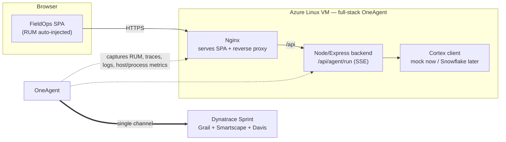

# FieldOps Copilot — Azure + Full-Stack OneAgent Demo Plan

> **⚠️ STATUS — historical MVP plan.** This document describes the original
> Node-based, all-OneAgent architecture. The repo has since evolved to:
>
> - **Python (FastAPI + sse-starlette)** instead of Node/Express.
> - **OpenLLMetry (Traceloop) → OTLP** for the AI / `gen_ai.*` telemetry,
>   alongside OneAgent which still handles host / Nginx / RUM / logs.
> - **OneAgent excluded from the uvicorn process group** (`DT_INJECT=false`
>   plus `builtin:process-group.monitoring.state = MONITORING_OFF`) so we
>   don't get a duplicate `fieldops-backend` service entity in the AI Obs app.
>
> Anything in this document referring to Node, custom OTel sensor capture by
> OneAgent, or "no OTLP exporter" reflects the original intent — **not the
> current deployment**.
>
> For the current state, see [the project README](../README.md).
> For the roadmap to a customer-shaped complete demo, see
> [Cortex_Agent_Complete_Demo_Plan.md](Cortex_Agent_Complete_Demo_Plan.md).
>
> The rationale, sub-agent definitions, dashboard tile design, and operator
> talk-track below remain useful reference material and are preserved as-is.

---

End-to-end observability demo for a field-service AI agent, provisioned on **Azure with Terraform**, instrumented entirely by **full-stack Dynatrace OneAgent** (no OTLP pipeline to manage), with a polished frontend and a **dtctl**-managed dashboard in your **Sprint** tenant.

The agent layer is a swappable mock today that emits the exact Cortex Agents SSE event shapes, so pointing it at a real Snowflake Cortex Agent later is a one-file change.

---

## 1. What the customer sees

- A real **distributed trace (PurePath)** from the browser (RUM) → Nginx → Node backend → each agent tool call (Cortex Analyst / Cortex Search), captured automatically by OneAgent.
- **RUM**: user actions, sessions, and frontend timing, auto-injected by OneAgent — no JS SDK in the page.
- **Logs** from the app and host, auto-ingested by OneAgent Log Monitoring, correlated to traces.
- **Metrics**: host, process, and service metrics out of the box; token/tool figures derived from span attributes in DQL.
- A **dashboard** built and version-controlled with dtctl.
- A believable field-service story (work orders, pump stations, asset manuals) matching the customer's app.

---

## 2. Architecture



Everything to Dynatrace travels over OneAgent's own channel. **No OTLP exporter, no ingest token in the app, no RUM tag in the HTML.** That is the point of going full-stack here.

---

## 3. Why full-stack OneAgent — and one language decision

OneAgent on the VM gives you, with zero app config: host + process metrics, log ingestion, deep code-level tracing of the web tier, and **automatic RUM injection** into pages served through the monitored web server. That removes the entire OTLP path the earlier plan needed, including the frontend.

**The one real constraint:** OneAgent's automatic capture of *custom* OpenTelemetry spans (the per-tool-call spans that are our whole differentiator) is supported for **Java, Go, Node.js, PHP, and .NET — not Python.** So:

- **Primary path (this plan): Node.js backend.** OneAgent auto-instruments Express for the service trace and captures our custom tool spans via its OpenTelemetry span sensor — no exporter. Cleanest realization of "OneAgent gathers everything."
- **If you must use Python:** keep the FastAPI version from the earlier plan, but send custom spans to **OneAgent's local-only OTLP endpoint** (`127.0.0.1`, traces-only). Still OneAgent-managed, just a localhost hop. Host/RUM/logs/metrics are unchanged.

We go Node.

---

## 4. Repo layout

```
fieldops-demo/
├── infra/
│   ├── main.tf
│   ├── variables.tf
│   ├── outputs.tf
│   └── cloud-init.yaml          # installs OneAgent, Node, Nginx, app
├── backend/
│   ├── server.js                # Express + SSE
│   ├── otel.js                  # OTel API provider (no exporter; OneAgent captures)
│   ├── agent/
│   │   ├── base.js              # event shapes + client interface
│   │   ├── mockClient.js        # field-service mock (today)
│   │   └── snowflakeClient.js   # real Cortex REST (drop-in later)
│   ├── package.json
│   └── fieldops-backend.service # systemd unit
├── frontend/
│   └── index.html               # polished SPA (no telemetry SDK)
├── dashboards/
│   └── fieldops-dashboard.json
└── README.md
```

---

## 5. Prerequisites

- Azure subscription + `az login`, Terraform ≥ 1.6.
- `dtctl` installed (`brew install dynatrace-oss/tap/dtctl`).
- Two Dynatrace tokens/credentials, by purpose:
  - **PaaS / installer token** — for the OneAgent install on the VM. Scope: `InstallerDownload`. Used only inside cloud-init.
  - **dtctl auth** — OAuth login for managing the dashboard (separate from the above).
- Your Sprint URLs:
  - OneAgent environment URL, e.g. `https://<env-id>.sprint.dynatracelabs.com`
  - Platform/apps URL for dtctl, e.g. `https://<env-id>.sprint.apps.dynatracelabs.com`
- An SSH public key and your current public IP (for the NSG).

> No ingest API token is needed anywhere in this design. OneAgent carries the data.

---

## 6. Step 1 — Terraform (Azure infrastructure)

`infra/variables.tf`:
```hcl
variable "prefix"            { default = "fieldops" }
variable "location"          { default = "eastus" }
variable "vm_size"           { default = "Standard_B2s" }
variable "admin_username"    { default = "azureuser" }
variable "ssh_public_key"    { type = string }            # contents of your .pub
variable "allowed_ip"        { type = string }            # your IP/32 for SSH+HTTP
variable "dt_environment_url" { type = string }           # https://<env>.sprint.dynatracelabs.com
variable "dt_paas_token"     { type = string, sensitive = true }
```

`infra/main.tf`:
```hcl
terraform {
  required_providers { azurerm = { source = "hashicorp/azurerm", version = "~> 3.110" } }
}
provider "azurerm" { features {} }

resource "azurerm_resource_group" "rg" {
  name     = "${var.prefix}-rg"
  location = var.location
}

resource "azurerm_virtual_network" "vnet" {
  name                = "${var.prefix}-vnet"
  address_space       = ["10.20.0.0/16"]
  location            = azurerm_resource_group.rg.location
  resource_group_name = azurerm_resource_group.rg.name
}
resource "azurerm_subnet" "subnet" {
  name                 = "${var.prefix}-subnet"
  resource_group_name  = azurerm_resource_group.rg.name
  virtual_network_name = azurerm_virtual_network.vnet.name
  address_prefixes     = ["10.20.1.0/24"]
}

resource "azurerm_public_ip" "pip" {
  name                = "${var.prefix}-pip"
  location            = azurerm_resource_group.rg.location
  resource_group_name = azurerm_resource_group.rg.name
  allocation_method   = "Static"
  sku                 = "Standard"
}

resource "azurerm_network_security_group" "nsg" {
  name                = "${var.prefix}-nsg"
  location            = azurerm_resource_group.rg.location
  resource_group_name = azurerm_resource_group.rg.name
  security_rule {
    name = "SSH"; priority = 100; direction = "Inbound"; access = "Allow"
    protocol = "Tcp"; source_port_range = "*"; destination_port_range = "22"
    source_address_prefix = var.allowed_ip; destination_address_prefix = "*"
  }
  security_rule {
    name = "HTTP"; priority = 110; direction = "Inbound"; access = "Allow"
    protocol = "Tcp"; source_port_range = "*"; destination_port_range = "80"
    source_address_prefix = var.allowed_ip; destination_address_prefix = "*"
  }
}

resource "azurerm_network_interface" "nic" {
  name                = "${var.prefix}-nic"
  location            = azurerm_resource_group.rg.location
  resource_group_name = azurerm_resource_group.rg.name
  ip_configuration {
    name                          = "internal"
    subnet_id                     = azurerm_subnet.subnet.id
    private_ip_address_allocation = "Dynamic"
    public_ip_address_id          = azurerm_public_ip.pip.id
  }
}
resource "azurerm_network_interface_security_group_association" "assoc" {
  network_interface_id      = azurerm_network_interface.nic.id
  network_security_group_id = azurerm_network_security_group.nsg.id
}

resource "azurerm_linux_virtual_machine" "vm" {
  name                  = "${var.prefix}-vm"
  resource_group_name   = azurerm_resource_group.rg.name
  location              = azurerm_resource_group.rg.location
  size                  = var.vm_size
  admin_username        = var.admin_username
  network_interface_ids = [azurerm_network_interface.nic.id]

  admin_ssh_key {
    username   = var.admin_username
    public_key = var.ssh_public_key
  }
  os_disk { caching = "ReadWrite"; storage_account_type = "Standard_LRS" }
  source_image_reference {
    publisher = "Canonical"; offer = "0001-com-ubuntu-server-jammy"
    sku = "22_04-lts"; version = "latest"
  }
  custom_data = base64encode(templatefile("${path.module}/cloud-init.yaml", {
    dt_url   = var.dt_environment_url
    dt_token = var.dt_paas_token
  }))
}
```

`infra/outputs.tf`:
```hcl
output "public_ip" { value = azurerm_public_ip.pip.ip_address }
output "url"       { value = "http://${azurerm_public_ip.pip.ip_address}" }
```

`infra/cloud-init.yaml` (installs OneAgent **full-stack**, Node, Nginx, deploys the app):
```yaml
#cloud-config
package_update: true
packages: [nginx, git, curl]
runcmd:
  # --- Node.js 20 ---
  - curl -fsSL https://deb.nodesource.com/setup_20.x | bash -
  - apt-get install -y nodejs

  # --- Dynatrace OneAgent (full-stack: host + deep code + logs + RUM injection) ---
  - wget -O /tmp/oneagent.sh "${dt_url}/api/v1/deployment/installer/agent/unix/default/latest?arch=x86&flavor=default" --header="Authorization: Api-Token ${dt_token}"
  - sh /tmp/oneagent.sh --set-app-log-content-access=true --set-host-group=fieldops-demo

  # --- Deploy app: clone the repo Copilot builds from this plan (backend/ + frontend/index.html
  #     are written verbatim from Sections 7 and 8). Replace <you> with the repo owner. ---
  - git clone https://github.com/<you>/fieldops-demo.git /opt/fieldops || true
  - cd /opt/fieldops/backend && npm install --omit=dev
  - cp /opt/fieldops/backend/fieldops-backend.service /etc/systemd/system/
  - systemctl daemon-reload && systemctl enable --now fieldops-backend

  # --- Frontend + reverse proxy ---
  - cp /opt/fieldops/frontend/index.html /var/www/html/index.html
  - bash -c 'cat > /etc/nginx/sites-available/default <<EOF
server {
  listen 80 default_server;
  root /var/www/html; index index.html;
  location / { try_files \$uri /index.html; }
  location /api/ {
    proxy_pass http://127.0.0.1:8000;
    proxy_http_version 1.1;
    proxy_set_header Connection "";
    proxy_buffering off;        # required so SSE streams through
    proxy_read_timeout 300s;
  }
}
EOF'
  - systemctl restart nginx
```

> Full-stack is the OneAgent default (no `--set-infra-only`). `--set-app-log-content-access=true` lets Log Monitoring read app logs. After install the host self-registers; no further app wiring.

---

## 7. Step 2 — Node backend (Express + SSE) with custom tool spans

`backend/package.json`:
```json
{
  "name": "fieldops-backend", "version": "0.1.0", "type": "module",
  "scripts": { "start": "node server.js" },
  "dependencies": {
    "express": "^4.19.2",
    "@opentelemetry/api": "^1.9.0",
    "@opentelemetry/sdk-trace-node": "^1.30.0"
  }
}
```

`backend/otel.js` — register an OTel tracer provider with **no exporter**; OneAgent's span sensor captures the spans into PurePath:
```javascript
import { NodeTracerProvider } from '@opentelemetry/sdk-trace-node';
const provider = new NodeTracerProvider();   // no exporter on purpose
provider.register();                          // OneAgent captures emitted spans
export {};
```

`backend/agent/base.js` — event shapes mirror Snowflake Cortex Agents exactly:
```javascript
// event names: response.status, response.thinking, response.tool_use,
// response.tool_result, response.table, response.text.delta, response, error
export const EVENTS = Object.freeze({
  STATUS:'response.status', THINKING:'response.thinking', TOOL_USE:'response.tool_use',
  TOOL_RESULT:'response.tool_result', TABLE:'response.table',
  TEXT_DELTA:'response.text.delta', DONE:'response', ERROR:'error'
});
```

`backend/agent/mockClient.js` — field-service scenarios, async generator:
```javascript
import { EVENTS } from './base.js';
const sleep = ms => new Promise(r => setTimeout(r, ms));

const SCENARIOS = {
  data: {
    thinking: "User wants work-order data. I'll query with Cortex Analyst, then summarize by site.",
    tool: 'cortex_analyst',
    sql: "SELECT site, COUNT(*) AS overdue FROM work_orders WHERE status='OPEN' AND due_date < CURRENT_DATE GROUP BY site",
    table: { columns:['site','overdue'], rows:[['Pump Station 4',7],['Compressor Yard',3],['North Intake',2]] },
    answer: "There are 12 overdue work orders. Pump Station 4 has the most (7), followed by Compressor Yard (3) and North Intake (2).",
    tokens: [180, 90]
  },
  knowledge: {
    thinking: "Knowledge question. I'll use Cortex Search over the asset manuals.",
    tool: 'cortex_search', sql: null, table: null,
    answer: "Per the asset manual, the quarterly procedure for centrifugal pumps is: isolate, lock out, inspect seals, check vibration, log readings.",
    tokens: [210, 140]
  }
};

export class MockCortexClient {
  async *run(messages) {
    const prompt = messages[messages.length - 1].content;
    const sc = /\bhow\b|procedure|manual|maintenance|inspect/i.test(prompt)
      ? SCENARIOS.knowledge : SCENARIOS.data;
    yield { event: EVENTS.STATUS, data: { message: 'Planning...' } };
    await sleep(300);
    yield { event: EVENTS.THINKING, data: { text: sc.thinking } };
    yield { event: EVENTS.TOOL_USE, data: { name: sc.tool, input: { query: prompt } } };
    await sleep(400 + Math.random() * 800);
    yield { event: EVENTS.TOOL_RESULT,
            data: { name: sc.tool, result: sc.sql ? { sql: sc.sql } : { hits: 4 } } };
    if (sc.table) yield { event: EVENTS.TABLE, data: { table: sc.table } };
    for (const part of sc.answer.split('. '))
      { yield { event: EVENTS.TEXT_DELTA, data: { text: part + '. ' } }; await sleep(100); }
    yield { event: EVENTS.DONE, data: { tokens_in: sc.tokens[0], tokens_out: sc.tokens[1], tool: sc.tool } };
  }
}
```

`backend/agent/snowflakeClient.js` — the later drop-in (same event objects out):
```javascript
import { EVENTS } from './base.js';
export class SnowflakeCortexClient {
  async *run(messages) {
    const { CORTEX_HOST, CORTEX_DATABASE='SNOWFLAKE_INTELLIGENCE',
            CORTEX_SCHEMA='AGENTS', CORTEX_AGENT, CORTEX_PAT } = process.env;
    const resp = await fetch(
      `https://${CORTEX_HOST}/api/v2/databases/${CORTEX_DATABASE}/schemas/${CORTEX_SCHEMA}/agents/${CORTEX_AGENT}:run`,
      { method:'POST', headers:{ 'Authorization':`Bearer ${CORTEX_PAT}`,
        'Content-Type':'application/json' },
        body: JSON.stringify({ model:'claude-4-sonnet', messages }) });
    if (!resp.ok) { yield { event: EVENTS.ERROR, data:{ message:`HTTP ${resp.status}` } }; return; }
    const reader = resp.body.getReader(); const dec = new TextDecoder(); let buf='';
    for (;;) { const { value, done } = await reader.read(); if (done) break;
      buf += dec.decode(value, { stream:true }); let i;
      while ((i = buf.indexOf('\n\n')) >= 0) {
        const block = buf.slice(0,i); buf = buf.slice(i+2);
        let ev='message', data=''; block.split('\n').forEach(l=>{
          if (l.startsWith('event:')) ev=l.slice(6).trim();
          else if (l.startsWith('data:')) data+=l.slice(5).trim(); });
        if (data) yield { event: ev, data: JSON.parse(data) };
      } }
  }
}
```

`backend/server.js` — SSE endpoint, custom **tool spans** (SpanKind.SERVER so OneAgent ingests them), structured logs to stdout (OneAgent Log Monitoring picks them up):
```javascript
import './otel.js';
import express from 'express';
import { randomUUID } from 'crypto';
import { trace, SpanKind, context } from '@opentelemetry/api';
import { MockCortexClient } from './agent/mockClient.js';
import { SnowflakeCortexClient } from './agent/snowflakeClient.js';
import { EVENTS } from './agent/base.js';

const tracer = trace.getTracer('fieldops-copilot');
const app = express();
app.use(express.json());
const log = (lvl, msg, extra={}) =>
  console.log(JSON.stringify({ level:lvl, msg, ts:new Date().toISOString(), ...extra }));
const client = () =>
  process.env.AGENT_MODE === 'snowflake' ? new SnowflakeCortexClient() : new MockCortexClient();

app.post('/api/agent/run', async (req, res) => {
  const { prompt, role='technician' } = req.body;
  const requestId = randomUUID();
  res.setHeader('Content-Type','text/event-stream');
  res.setHeader('Cache-Control','no-cache');
  res.flushHeaders();

  // Root agent span (child of the Express server span OneAgent already created)
  const root = tracer.startSpan('agent.run', { kind: SpanKind.SERVER });
  root.setAttribute('gen_ai.system','snowflake.cortex');
  root.setAttribute('user.role', role);
  root.setAttribute('snowflake.request_id', requestId);   // join key for later
  root.setAttribute('gen_ai.prompt', prompt);
  log('info','agent request', { requestId, role });

  const ctx = trace.setSpan(context.active(), root);
  const openTools = new Map();
  try {
    for await (const ev of client().run([{ role:'user', content: prompt }])) {
      if (ev.event === EVENTS.TOOL_USE) {
        const span = tracer.startSpan(`tool.${ev.data.name}`, { kind: SpanKind.SERVER }, ctx);
        span.setAttribute('gen_ai.tool.name', ev.data.name);
        if (ev.data.input?.query) span.setAttribute('gen_ai.tool.query', ev.data.input.query);
        openTools.set(ev.data.name, span);
        log('info','tool invoked', { requestId, tool: ev.data.name });
      } else if (ev.event === EVENTS.TOOL_RESULT) {
        const span = openTools.get(ev.data.name);
        if (span) { if (ev.data.result?.sql) span.setAttribute('db.statement', ev.data.result.sql);
                    span.end(); openTools.delete(ev.data.name); }
        log('info','tool result', { requestId, tool: ev.data.name });
      } else if (ev.event === EVENTS.DONE) {
        root.setAttribute('gen_ai.usage.input_tokens', ev.data.tokens_in ?? 0);
        root.setAttribute('gen_ai.usage.output_tokens', ev.data.tokens_out ?? 0);
      } else if (ev.event === EVENTS.ERROR) {
        root.setAttribute('error', true); log('error','agent error', { requestId, ...ev.data });
      }
      res.write(`event: ${ev.event}\ndata: ${JSON.stringify(ev.data)}\n\n`);
    }
  } catch (e) {
    root.setAttribute('error', true); log('error','stream failed', { requestId, err:String(e) });
  } finally {
    for (const s of openTools.values()) s.end();
    root.end(); res.end();
  }
});

app.listen(8000, () => log('info','backend listening', { port: 8000 }));
```

`backend/fieldops-backend.service`:
```ini
[Unit]
Description=FieldOps Copilot backend
After=network.target oneagent.service
[Service]
WorkingDirectory=/opt/fieldops/backend
Environment=AGENT_MODE=mock
ExecStart=/usr/bin/node server.js
Restart=always
User=root
[Install]
WantedBy=multi-user.target
```

---

## 8. Step 3 — Frontend

Write the following verbatim to `frontend/index.html`. It is a self-contained SPA — control-room styling, role selector, streaming answers, and a diagnostic readout that lights up per tool call. It carries **no telemetry SDK**: OneAgent injects RUM automatically. It also includes a built-in simulator so it previews locally before the backend exists. Nginx serves it at `/` and proxies `/api` to the Node backend (configured in cloud-init, with `proxy_buffering off` so SSE streams).

```html
<!doctype html>
<html lang="en">
<head>
<meta charset="utf-8" />
<meta name="viewport" content="width=device-width, initial-scale=1" />
<title>FieldOps Copilot</title>
<!-- RUM is auto-injected by Dynatrace OneAgent on the host. No OTLP/JS SDK here. -->
<link rel="preconnect" href="https://fonts.googleapis.com">
<link rel="preconnect" href="https://fonts.gstatic.com" crossorigin>
<link href="https://fonts.googleapis.com/css2?family=Saira:wght@500;600;700&family=Inter:wght@400;500;600&family=IBM+Plex+Mono:wght@400;500&display=swap" rel="stylesheet">
<style>
  :root{
    --bg:#15181E; --panel:#1E222A; --panel-2:#262B34; --line:#323844;
    --amber:#FFB000; --amber-dim:rgba(255,176,0,.14); --cyan:#5BC8D6;
    --text:#E8E6E1; --muted:#8A9099; --ok:#4BB377; --alert:#E5484D;
    --mono:"IBM Plex Mono",ui-monospace,monospace;
    --disp:"Saira",system-ui,sans-serif; --body:"Inter",system-ui,sans-serif;
  }
  *{box-sizing:border-box}
  html,body{margin:0;height:100%}
  body{background:var(--bg);color:var(--text);font-family:var(--body);
    font-size:15px;line-height:1.5;display:flex;flex-direction:column;height:100vh;overflow:hidden}
  /* ---- top bar ---- */
  header{display:flex;align-items:center;gap:14px;padding:14px 20px;
    border-bottom:1px solid var(--line);background:linear-gradient(180deg,#1b1f27,#15181e)}
  .logo{width:30px;height:30px;border-radius:6px;flex:none;position:relative;
    background:radial-gradient(circle at 30% 30%,#3a4150,#22262e);border:1px solid var(--line)}
  .logo::after{content:"";position:absolute;inset:9px;border-radius:50%;
    background:var(--amber);box-shadow:0 0 10px var(--amber)}
  .brand{font-family:var(--disp);font-weight:700;letter-spacing:.04em;font-size:18px}
  .brand span{color:var(--amber)}
  .sys{margin-left:auto;font-family:var(--mono);font-size:11px;color:var(--muted);
    display:flex;align-items:center;gap:8px}
  .dot{width:7px;height:7px;border-radius:50%;background:var(--ok);box-shadow:0 0 8px var(--ok)}
  /* ---- layout ---- */
  .wrap{flex:1;display:grid;grid-template-columns:248px 1fr;min-height:0}
  aside{border-right:1px solid var(--line);padding:18px 16px;overflow:auto;background:#171b22}
  .eyebrow{font-family:var(--mono);font-size:10px;letter-spacing:.18em;
    text-transform:uppercase;color:var(--muted);margin:0 0 10px}
  .roles{display:flex;flex-direction:column;gap:6px;margin-bottom:24px}
  .role{appearance:none;text-align:left;cursor:pointer;border:1px solid var(--line);
    background:var(--panel);color:var(--text);padding:10px 12px;border-radius:8px;
    font-family:var(--disp);font-weight:600;font-size:14px;letter-spacing:.02em;
    display:flex;align-items:center;gap:10px;transition:border-color .15s,background .15s}
  .role:hover{border-color:#46506180}
  .role[aria-pressed="true"]{border-color:var(--amber);background:var(--amber-dim)}
  .role .tag{margin-left:auto;font-family:var(--mono);font-size:10px;color:var(--muted)}
  .chip{display:block;width:100%;text-align:left;cursor:pointer;margin-bottom:6px;
    border:1px solid transparent;background:transparent;color:var(--muted);
    padding:8px 10px;border-radius:7px;font-family:var(--body);font-size:13px;
    transition:color .15s,background .15s,border-color .15s}
  .chip:hover{color:var(--text);background:var(--panel);border-color:var(--line)}
  /* ---- conversation ---- */
  main{display:flex;flex-direction:column;min-height:0}
  .stream{flex:1;overflow:auto;padding:26px 28px;scroll-behavior:smooth}
  .turn{max-width:760px;margin:0 auto 26px}
  .who{font-family:var(--mono);font-size:10px;letter-spacing:.16em;text-transform:uppercase;
    color:var(--muted);margin-bottom:7px;display:flex;align-items:center;gap:8px}
  .who::before{content:"";width:5px;height:5px;border-radius:50%;background:var(--muted)}
  .turn.user .bubble{background:var(--panel-2);border:1px solid var(--line);
    border-radius:10px;padding:12px 15px}
  .turn.user .who::before{background:var(--cyan)}
  .turn.bot .who::before{background:var(--amber)}
  .answer{font-size:16px;line-height:1.62}
  /* ---- signature: diagnostic readout ---- */
  .readout{border:1px solid var(--line);border-radius:10px;overflow:hidden;
    margin:4px 0 14px;background:var(--panel)}
  .readout-head{display:flex;align-items:center;gap:12px;padding:10px 14px;
    border-bottom:1px solid var(--line);background:#1a1e26}
  .stage{font-family:var(--mono);font-size:11px;letter-spacing:.06em;color:var(--muted);
    display:flex;align-items:center;gap:7px}
  .stage .led{width:8px;height:8px;border-radius:50%;background:#3a4150;flex:none}
  .stage.on{color:var(--text)}
  .stage.on .led{background:var(--amber);box-shadow:0 0 9px var(--amber);animation:pulse 1.1s infinite}
  .stage.done{color:var(--ok)}
  .stage.done .led{background:var(--ok);box-shadow:none;animation:none}
  .sep{flex:none;width:18px;height:1px;background:var(--line)}
  .tool-name{margin-left:auto;font-family:var(--disp);font-weight:700;font-size:12px;
    letter-spacing:.08em;color:var(--amber);text-transform:uppercase}
  .readout-body{padding:0 14px;max-height:0;overflow:hidden;transition:max-height .3s ease,padding .3s}
  .readout-body.open{max-height:340px;padding:12px 14px}
  .kv{font-family:var(--mono);font-size:12px;color:var(--muted);margin:0 0 8px}
  .kv b{color:var(--text);font-weight:500}
  pre.sql{font-family:var(--mono);font-size:12px;color:#cdd3db;background:#13161c;
    border:1px solid var(--line);border-radius:7px;padding:10px 12px;margin:0;overflow:auto;
    white-space:pre-wrap}
  .think{font-size:14px;color:var(--muted);font-style:italic;border-left:2px solid var(--line);
    padding-left:12px;margin:0 0 6px}
  /* ---- data grid ---- */
  table{border-collapse:collapse;width:100%;margin:12px 0 4px;font-size:13px}
  th,td{text-align:left;padding:8px 12px;border-bottom:1px solid var(--line)}
  th{font-family:var(--mono);font-size:10px;letter-spacing:.1em;text-transform:uppercase;
    color:var(--muted);font-weight:500}
  td{font-family:var(--mono);font-size:13px}
  tr:hover td{background:#1c2027}
  .metric{color:var(--amber);font-weight:500}
  /* ---- composer ---- */
  .composer{border-top:1px solid var(--line);padding:16px 28px;background:#171b22}
  .field{max-width:760px;margin:0 auto;display:flex;gap:10px;align-items:center;
    background:var(--panel);border:1px solid var(--line);border-radius:10px;padding:6px 6px 6px 16px;
    transition:border-color .15s}
  .field:focus-within{border-color:var(--amber)}
  .field input{flex:1;background:none;border:none;color:var(--text);font-family:var(--body);
    font-size:15px;outline:none}
  .field input::placeholder{color:var(--muted)}
  .send{appearance:none;border:none;cursor:pointer;background:var(--amber);color:#1a1205;
    font-family:var(--disp);font-weight:700;font-size:14px;letter-spacing:.04em;
    padding:9px 18px;border-radius:7px;transition:filter .15s}
  .send:hover{filter:brightness(1.08)}
  .send:disabled{opacity:.5;cursor:default}
  .hint{max-width:760px;margin:8px auto 0;font-family:var(--mono);font-size:10px;color:var(--muted)}
  .cursor{display:inline-block;width:8px;height:1.05em;background:var(--amber);
    vertical-align:-2px;margin-left:1px;animation:blink 1s steps(2) infinite}
  @keyframes pulse{0%,100%{opacity:1}50%{opacity:.35}}
  @keyframes blink{0%{opacity:1}50%{opacity:0}}
  @media (prefers-reduced-motion:reduce){*{animation:none!important;scroll-behavior:auto}}
  @media (max-width:720px){.wrap{grid-template-columns:1fr}aside{display:none}}
  :focus-visible{outline:2px solid var(--cyan);outline-offset:2px}
</style>
</head>
<body>
<header>
  <div class="logo" aria-hidden="true"></div>
  <div class="brand">FIELD<span>OPS</span> COPILOT</div>
  <div class="sys"><span class="dot"></span>AGENT ONLINE &middot; <span id="mode">MOCK</span></div>
</header>

<div class="wrap">
  <aside>
    <p class="eyebrow">Shift role</p>
    <div class="roles" id="roles">
      <button class="role" data-role="technician" aria-pressed="true">
        Technician <span class="tag">FIELD</span></button>
      <button class="role" data-role="maintenance_manager" aria-pressed="false">
        Maint. Manager <span class="tag">OPS</span></button>
    </div>
    <p class="eyebrow">Quick diagnostics</p>
    <button class="chip">Show overdue work orders for pump stations</button>
    <button class="chip">What is the quarterly maintenance procedure for pumps?</button>
    <button class="chip">Which assets are due for service this week?</button>
    <button class="chip">Open work orders by site</button>
  </aside>

  <main>
    <div class="stream" id="stream">
      <div class="turn bot">
        <div class="who">Copilot</div>
        <div class="answer">Ask about work orders, schedules, or asset procedures. Every
          answer shows its work: planning, the tool the agent runs, the query it generates,
          and the result &mdash; the same trace Dynatrace captures end to end.</div>
      </div>
    </div>

    <div class="composer">
      <div class="field">
        <input id="q" autocomplete="off"
          placeholder="Ask the field-service agent&hellip;" />
        <button class="send" id="send">Run</button>
      </div>
      <div class="hint" id="hint">Trace starts in the browser &middot; OneAgent RUM &rarr; backend &rarr; agent tool calls</div>
    </div>
  </main>
</div>

<script>
const stream = document.getElementById('stream');
const input = document.getElementById('q');
const send  = document.getElementById('send');
let role = 'technician';

document.getElementById('roles').addEventListener('click', e=>{
  const b = e.target.closest('.role'); if(!b) return;
  role = b.dataset.role;
  [...document.querySelectorAll('.role')].forEach(r=>
    r.setAttribute('aria-pressed', r===b));
});
document.querySelectorAll('.chip').forEach(c=>
  c.addEventListener('click',()=>{input.value=c.textContent;ask();}));
send.addEventListener('click', ask);
input.addEventListener('keydown', e=>{if(e.key==='Enter') ask();});

function el(html){const t=document.createElement('template');t.innerHTML=html.trim();return t.content.firstChild;}
function scroll(){stream.scrollTop = stream.scrollHeight;}

function addUser(text){
  stream.appendChild(el(`<div class="turn user"><div class="who">${role.replace('_',' ')}</div>
    <div class="bubble">${text}</div></div>`));
  scroll();
}

function botTurn(){
  const turn = el(`<div class="turn bot"><div class="who">Copilot</div>
    <div class="readout">
      <div class="readout-head">
        <div class="stage" data-s="plan"><span class="led"></span>PLANNING</div>
        <div class="sep"></div>
        <div class="stage" data-s="tool"><span class="led"></span>TOOL</div>
        <div class="sep"></div>
        <div class="stage" data-s="result"><span class="led"></span>RESULT</div>
        <div class="tool-name" data-name></div>
      </div>
      <div class="readout-body"></div>
    </div>
    <div class="answer"></div></div>`);
  stream.appendChild(turn); scroll();
  return {
    turn,
    stageEl: s=>turn.querySelector(`.stage[data-s="${s}"]`),
    body: turn.querySelector('.readout-body'),
    nameEl: turn.querySelector('[data-name]'),
    answer: turn.querySelector('.answer'),
  };
}
function setStage(ui,s,state){const e=ui.stageEl(s);e.classList.remove('on','done');e.classList.add(state);}

// ---- SSE event handling (identical shape for mock + real Snowflake) ----
function handleEvent(ui, ev, data){
  switch(ev){
    case 'response.status':
      setStage(ui,'plan','on'); break;
    case 'response.thinking':
      setStage(ui,'plan','done');
      ui.body.classList.add('open');
      ui.body.appendChild(el(`<p class="think">${data.text||''}</p>`)); scroll(); break;
    case 'response.tool_use':
      setStage(ui,'tool','on');
      ui.nameEl.textContent = (data.name||'').replace('_',' ');
      ui.body.classList.add('open');
      if(data.input&&data.input.query)
        ui.body.appendChild(el(`<p class="kv">query &middot; <b>${data.input.query}</b></p>`));
      scroll(); break;
    case 'response.tool_result':
      setStage(ui,'tool','done'); setStage(ui,'result','on');
      const sql = data.result && data.result.sql;
      if(sql) ui.body.appendChild(el(`<pre class="sql">${sql}</pre>`));
      else ui.body.appendChild(el(`<p class="kv">knowledge hits &middot; <b>${(data.result||{}).hits||0}</b></p>`));
      scroll(); break;
    case 'response.table':
      setStage(ui,'result','done');
      const t = data.table; if(!t) break;
      let h='<table><thead><tr>'+t.columns.map(c=>`<th>${c}</th>`).join('')+'</tr></thead><tbody>';
      h+=t.rows.map(r=>'<tr>'+r.map((v,i)=>i===0?`<td>${v}</td>`:`<td class="metric">${v}</td>`).join('')+'</tr>').join('');
      ui.answer.parentNode.insertBefore(el(h+'</tbody></table>'), ui.answer); scroll(); break;
    case 'response.text.delta':
      setStage(ui,'result','done');
      ui.answer.textContent += data.text||''; scroll(); break;
    case 'response':
      const c=ui.answer.querySelector('.cursor'); if(c) c.remove();
      if(data.tokens_in!=null)
        ui.body.appendChild(el(`<p class="kv" style="margin-top:8px">tokens &middot; <b>${data.tokens_in} in / ${data.tokens_out} out</b></p>`));
      break;
    case 'error':
      ui.answer.textContent = 'Agent error: '+(data.message||'unknown'); break;
  }
}

async function ask(){
  const text = input.value.trim(); if(!text) return;
  input.value=''; send.disabled=true;
  addUser(text);
  const ui = botTurn();
  ui.answer.appendChild(el('<span class="cursor"></span>'));
  try{
    const resp = await fetch('/api/agent/run',{method:'POST',
      headers:{'Content-Type':'application/json'},
      body:JSON.stringify({prompt:text,role})});
    if(!resp.ok||!resp.body) throw new Error('backend');
    await readSSE(resp.body, ui);
  }catch(_){
    // Standalone preview fallback so the UI demos without the backend.
    await simulate(text, ui);
  }
  const c=ui.answer.querySelector('.cursor'); if(c) c.remove();
  send.disabled=false; input.focus();
}

async function readSSE(body, ui){
  const reader=body.getReader(), dec=new TextDecoder(); let buf='';
  for(;;){
    const {value,done}=await reader.read(); if(done) break;
    buf+=dec.decode(value,{stream:true});
    let i; while((i=buf.indexOf('\n\n'))>=0){
      const block=buf.slice(0,i); buf=buf.slice(i+2);
      let ev='message',data='';
      block.split('\n').forEach(l=>{
        if(l.startsWith('event:')) ev=l.slice(6).trim();
        else if(l.startsWith('data:')) data+=l.slice(5).trim();
      });
      if(data) handleEvent(ui,ev,JSON.parse(data));
    }
  }
}

// ---- built-in simulator (mirrors backend mock event sequence) ----
const wait=ms=>new Promise(r=>setTimeout(r,ms));
async function simulate(prompt, ui){
  const search = /\bhow\b|procedure|manual|maintenance|inspect/i.test(prompt);
  await wait(300); handleEvent(ui,'response.status',{});
  await wait(500); handleEvent(ui,'response.thinking',{text: search
    ? "Knowledge question. I'll use Cortex Search over the asset manuals."
    : "User wants work-order data. I'll query with Cortex Analyst, then summarize by site."});
  await wait(400);
  handleEvent(ui,'response.tool_use',{name: search?'cortex_search':'cortex_analyst',
    input:{query:prompt}});
  await wait(900);
  if(search){
    handleEvent(ui,'response.tool_result',{name:'cortex_search',result:{hits:4}});
    await stream_text(ui,"Per the asset manual, the quarterly procedure for centrifugal pumps is: isolate, lock out, inspect seals, check vibration, log readings.");
    handleEvent(ui,'response',{tokens_in:210,tokens_out:140});
  }else{
    handleEvent(ui,'response.tool_result',{name:'cortex_analyst',result:{sql:
      "SELECT site, COUNT(*) AS overdue\nFROM work_orders\nWHERE status='OPEN' AND due_date < CURRENT_DATE\nGROUP BY site"}});
    await wait(300);
    handleEvent(ui,'response.table',{table:{columns:["site","overdue"],
      rows:[["Pump Station 4",7],["Compressor Yard",3],["North Intake",2]]}});
    await stream_text(ui,"There are 12 overdue work orders. Pump Station 4 has the most (7), followed by Compressor Yard (3) and North Intake (2).");
    handleEvent(ui,'response',{tokens_in:180,tokens_out:90});
  }
}
async function stream_text(ui,txt){
  for(const part of txt.split('. ')){
    handleEvent(ui,'response.text.delta',{text:part.endsWith('.')?part+' ':part+'. '});
    await wait(120);
  }
}
</script>
</body>
</html>
```

---

## 9. Step 4 — OneAgent configuration (three quick toggles)

After the host appears in Dynatrace:

1. **Enable OpenTelemetry (Node.js) span capture.** Settings → Collect and capture → OneAgent features → enable the OpenTelemetry Node.js sensor. This lets OneAgent ingest the custom `agent.run` / `tool.*` spans.
2. **Allow-list custom span attributes** so they're stored/queryable: add `gen_ai.tool.name`, `gen_ai.tool.query`, `db.statement`, `user.role`, `snowflake.request_id`, `gen_ai.usage.input_tokens`, `gen_ai.usage.output_tokens`, `gen_ai.prompt`, `gen_ai.completion`, `gen_ai.context`, `gen_ai.response_id` under attribute capturing. Until allow-listed, attributes won't persist in Grail. The last four are required by [dynatrace-oss/dt-evals](https://github.com/dynatrace-oss/dt-evals) for faithfulness / relevance / hallucination evaluators.
3. **RUM application + injection.** Confirm a web application is auto-created for the host and that automatic injection is on for the Nginx-served page. If the static SPA isn't auto-injected, enable injection for the web app or paste the RUM snippet from the app's settings into `<head>` as a fallback.

> Note on span kind: OneAgent by default ingests only `Server`/`Consumer` spans to protect PurePath integrity, which is why the tool spans above are created as `SpanKind.SERVER`. They show as nested service nodes — which actually demos well (Cortex Analyst / Cortex Search appear as their own steps).

---

## 10. Step 5 — Deploy

```bash
cd infra
terraform init
terraform apply \
  -var="ssh_public_key=$(cat ~/.ssh/id_rsa.pub)" \
  -var="allowed_ip=$(curl -s ifconfig.me)/32" \
  -var="dt_environment_url=https://<env-id>.sprint.dynatracelabs.com" \
  -var="dt_paas_token=dt0c01.XXXX..."
# open the printed URL, ask a question, watch it stream
```

Verify in Dynatrace: Hosts shows `fieldops-vm` with the OneAgent; a RUM session appears when you use the app; Distributed Traces shows browser → Nginx → `agent.run` → `tool.cortex_analyst`.

---

## 11. Step 6 — dtctl: verify and build the dashboard

Connect:
```bash
dtctl auth login --context sprint --environment "https://<env-id>.sprint.apps.dynatracelabs.com"
dtctl config use-context sprint && dtctl doctor
```

Verify the data is landing (all from OneAgent — no OTLP):
```bash
# End-to-end agent spans
dtctl query "fetch spans | filter span.name == \"agent.run\" | sort timestamp desc | limit 20"

# Tool calls inside the trace
dtctl query "fetch spans | filter span.name startsWith \"tool.\" \
  | summarize calls=count(), avg(duration), by:{span.name}"

# Tokens (from allow-listed span attributes)
dtctl query "fetch spans | filter span.name == \"agent.run\" \
  | summarize in=sum(gen_ai.usage.input_tokens), out=sum(gen_ai.usage.output_tokens), by:{user.role}"

# App logs (OneAgent Log Monitoring)
dtctl query "fetch logs | filter contains(content, \"tool invoked\") | sort timestamp desc | limit 20"

# Host metrics (OneAgent built-ins)
dtctl query "timeseries avg(dt.host.cpu.usage), by:{dt.entity.host}"
```

Dashboard as code — author once, then capture and version (schema-proof):
```bash
# Build tiles in the UI from the queries above, then:
dtctl get dashboards --mine
dtctl get dashboard <id> -o json > dashboards/fieldops-dashboard.json
# It's now code — edit queries locally and push:
dtctl apply -f dashboards/fieldops-dashboard.json
```

Suggested tiles: agent request rate by role, answer latency p90 (from `agent.run` span duration), tool duration by `span.name`, tokens in/out, recent traces table (with `snowflake.request_id`), app logs, host CPU/memory.

---

## 12. Demo talk track (5 minutes)

1. **Open the app** (the Azure URL). Note it looks like a real field-service tool.
2. **Ask** "Show overdue work orders for pump stations." Watch the diagnostic readout step through planning → tool → result and the answer stream in.
3. **Switch to Dynatrace, open the trace.** Browser RUM action → Nginx → `agent.run` → `tool.cortex_analyst` with the SQL on the span. "This is one trace, captured by a single agent, no code-level OTLP plumbing."
4. **Logs in context** from the span. **Host view**: the same VM's CPU/memory/process. "App, infra, user experience — one platform, one agent."
5. **Dashboard**: latency, tool duration, tokens. "Performance and cost together."
6. **Close:** "Today the agent is a stand-in. Point it at your Snowflake Cortex Agent and this exact view fills with your real work orders — one file changes."

---

## 13. Step 7 — Swap to real Snowflake later

1. On the VM: set `AGENT_MODE=snowflake` plus `CORTEX_HOST`, `CORTEX_DATABASE`, `CORTEX_SCHEMA`, `CORTEX_AGENT`, `CORTEX_PAT` in the systemd unit, `systemctl restart fieldops-backend`.
2. Nothing else changes: `SnowflakeCortexClient` yields the same events, so the spans, logs, dashboard, and DQL are identical.
3. Add the Snowflake-internal depth (generated SQL detail, token accounting, Snowflake's own spans) by pulling `GET_AI_OBSERVABILITY_EVENTS` on a schedule and joining to traces by `snowflake.request_id`, which `agent.run` already carries.

The honest boundary is unchanged: the live trace covers everything your code touches plus the agent's streamed steps; Snowflake's deepest internals join by request ID shortly after, not natively inside the live span. That limitation is Snowflake's, not Dynatrace's.

---

## 14. Troubleshooting

- **Host not in Dynatrace** → check the PaaS token scope (`InstallerDownload`) and `dt_environment_url`; `cloud-init` logs at `/var/log/cloud-init-output.log`.
- **Traces present, tool spans missing** → enable the OneAgent OpenTelemetry Node.js sensor (Step 4.1); confirm spans are `SpanKind.SERVER`.
- **Span attributes blank** → allow-list them (Step 4.2). This is the most common "it works but no data" cause.
- **SSE not streaming (answer appears all at once)** → `proxy_buffering off` in the Nginx `/api` block.
- **No RUM** → enable injection for the web app or paste the RUM snippet into `index.html` `<head>`.
- **Dashboard apply rejected** → use the pull-then-edit flow (Step 11) to match your tenant's schema version.

## 15. Teardown
```bash
cd infra && terraform destroy   # removes the RG and everything in it
```

---

# 16. Agentic execution with GitHub Copilot

This plan is built to be executed by GitHub Copilot using a small team of **custom agents (sub-agents)** and **skills**. Copilot runs each sub-agent in an isolated context and delegates by matching the request to the agent's description, so the build stays organized and each step uses the right model.

**Model policy:** Opus 4.7 for work that needs real reasoning (orchestration, instrumentation correctness, critical review). Sonnet 4.6 for mechanical work driven by a clear spec (HCL authoring, wiring a provided file, running documented commands). This keeps the build fast and cheap without sacrificing the parts that bite.

> Model slugs below (`claude-opus-4.7`, `claude-sonnet-4.6`) should match the entries in your Copilot model picker. If a slug isn't recognized, keep the agent file and select the model manually from the picker — the assignment rationale is what matters.

## 16.1 Phase 0 — scaffold the agent team (Copilot does this first)

Create these files before any build work.

### Sub-agents → `.github/agents/`

**`build-orchestrator.md`** — Opus 4.7 (reads the plan, sequences phases, delegates, diagnoses failures)
```markdown
---
name: build-orchestrator
description: Owns end-to-end execution of the FieldOps demo plan. Reads the plan, sequences phases, delegates to specialist sub-agents, and diagnoses failures. Use for any "build/execute the plan" request.
tools: [read, search, edit, runCommands, todos]
model: claude-opus-4.7
---
You orchestrate the FieldOps Copilot demo build from the plan markdown.
Rules:
1. Read the entire plan before acting. Build a checklist (todos) mirroring the phases.
2. Delegate: infra → infra-terraform; backend → backend-instrumentation; frontend → frontend-integration; Dynatrace/dtctl → dynatrace-dtctl; final check → build-reviewer.
3. NEVER run `terraform apply` or any command that spends money or sends secrets until the user has supplied real values for tokens, SSH key, and IP, and has explicitly approved.
4. Keep AGENT_MODE=mock. Do not wire real Snowflake credentials.
5. After scaffolding and after each phase, pause and report status; wait for approval before the next phase.
6. When a sub-agent reports a failure, reason about the cause yourself before retrying; consult the dynatrace-oneagent-otel skill for telemetry issues.
```

**`infra-terraform.md`** — Sonnet 4.6 (mechanical HCL + cloud-init from the spec)
```markdown
---
name: infra-terraform
description: Authors and validates the Terraform (Azure VM, network, NSG) and cloud-init from the plan. Runs terraform init/validate/fmt only. Does not apply without approval.
tools: [read, edit, runCommands]
model: claude-sonnet-4.6
---
You write the infra/ files exactly as specified in the plan (main.tf, variables.tf,
outputs.tf, cloud-init.yaml). Use the azurerm provider version pinned in the plan.
Run only: terraform fmt, terraform init, terraform validate. Report the plan output.
Stop before apply. Flag any placeholder (<env-id>, <you>, tokens) that needs a real value.
```

**`backend-instrumentation.md`** — Opus 4.7 (the subtle part: OTel span kind, SSE correctness, swappable contract)
```markdown
---
name: backend-instrumentation
description: Builds the Node/Express backend, the swappable Cortex client (mock + Snowflake stub), and the custom OpenTelemetry tool spans. Use for backend, tracing, or SSE work.
tools: [read, edit, runCommands]
model: claude-opus-4.7
---
You build backend/ per the plan. Load the cortex-agent-protocol and dynatrace-oneagent-otel skills first.
Non-negotiables:
1. Mock and Snowflake clients emit IDENTICAL event shapes (cortex-agent-protocol skill).
2. Custom tool spans use SpanKind.SERVER so OneAgent ingests them; no OTLP exporter.
3. SSE writes flush; never buffer the stream.
4. Structured JSON logs to stdout for OneAgent Log Monitoring.
5. Stamp snowflake.request_id on the agent.run span.
Verify locally with `node server.js` and a curl against /api/agent/run in mock mode.
```

**`frontend-integration.md`** — Sonnet 4.6 (place and wire the provided SPA)
```markdown
---
name: frontend-integration
description: Places the provided index.html, confirms it calls /api/agent/run, and verifies the SSE parsing and simulator fallback. No telemetry SDK in the page (OneAgent injects RUM).
tools: [read, edit, runCommands]
model: claude-sonnet-4.6
---
You write frontend/index.html verbatim from the HTML block in Step 3 of the plan. Do not add any OTel or RUM
JavaScript — OneAgent injects RUM. Confirm the fetch path is relative (/api/agent/run) so
Nginx proxies it. Verify the page renders and the built-in simulator works offline.
```

**`dynatrace-dtctl.md`** — Sonnet 4.6 (runs documented dtctl commands + DQL; escalates diagnosis to orchestrator)
```markdown
---
name: dynatrace-dtctl
description: Connects dtctl to the sprint context, runs the verification DQL, and builds/applies the dashboard via the pull-then-push flow. Use for any dtctl, DQL, or dashboard task.
tools: [read, edit, runCommands]
model: claude-sonnet-4.6
---
You operate dtctl per the plan. Load the installed dtctl skill. Use context "sprint".
Run the verification queries from Step 11 and report what is and isn't landing.
Build the dashboard in the UI, then `dtctl get dashboard <id> -o json` to capture it, version it,
and `dtctl apply`. If a verification query returns nothing, report it to build-orchestrator
with the exact query and result — do not silently proceed.
```

**`build-reviewer.md`** — Opus 4.7 (critical review against the plan and the known gotchas)
```markdown
---
name: build-reviewer
description: Reviews the assembled repo against the plan before deploy. Checks the known failure points. Use as the final gate.
tools: [read, search]
model: claude-opus-4.7
---
You are the final gate. Verify against the plan, and specifically confirm:
1. Tool spans are SpanKind.SERVER; no OTLP exporter anywhere in the app.
2. Nginx /api block has proxy_buffering off (SSE).
3. The OneAgent attribute allow-list step is documented for the operator (Step 4.2).
4. Snowflake client has no stray quote in the auth header and no verify=false equivalent.
5. Mock and Snowflake clients yield identical event shapes.
6. No real secrets are committed; placeholders are clearly marked.
Produce a short pass/fail checklist with file:line references.
```

### Skills

1. **Install the official dtctl skill** (don't rebuild it):
   ```bash
   npx skills add dynatrace-oss/dtctl    # or: dtctl skills install --for copilot
   ```
2. **Create `.github/skills/cortex-agent-protocol/SKILL.md`** — the event contract that keeps mock, real, and frontend in sync:
   ```markdown
   ---
   name: cortex-agent-protocol
   description: The Snowflake Cortex Agents SSE event contract and the swappable-client rule. Load when building or changing the backend agent clients or the frontend stream parser.
   ---
   Event names (exact): response.status, response.thinking, response.tool_use,
   response.tool_result, response.table, response.text.delta, response, error.
   Rule: MockCortexClient and SnowflakeCortexClient MUST emit identical event objects so the
   server instrumentation and the frontend parser never change when swapping. The frontend
   parses SSE as event:/data: blocks separated by a blank line.
   ```
3. **Create `.github/skills/dynatrace-oneagent-otel/SKILL.md`** — the three gotchas plus verification:
   ```markdown
   ---
   name: dynatrace-oneagent-otel
   description: How OneAgent captures custom OpenTelemetry spans and the config that makes it work. Load for any tracing, span, or "no data in Dynatrace" issue.
   ---
   1. OneAgent auto-captures custom OTel spans for Java, Go, Node.js, PHP, .NET — NOT Python.
   2. OneAgent ingests only Server/Consumer span kinds by default → create tool spans as SpanKind.SERVER.
   3. Custom span attributes are NOT stored until allow-listed in Settings (attribute capturing):
      gen_ai.tool.name, gen_ai.tool.query, db.statement, user.role, snowflake.request_id,
      gen_ai.usage.input_tokens, gen_ai.usage.output_tokens.
   4. Enable the OneAgent OpenTelemetry (Node.js) sensor. No OTLP exporter — OneAgent ships the data.
   Verify with: fetch spans | filter span.name == "agent.run".
   ```

### Repo custom instructions → `.github/copilot-instructions.md`
```markdown
# FieldOps demo — repo instructions
This repo is built from the plan in /docs/Cortex_Agent_Azure_OneAgent_Demo_Plan.md.
- Backend is Node (not Python) so OneAgent captures custom OTel spans. No OTLP exporters.
- Keep AGENT_MODE=mock until the operator provides Snowflake credentials.
- Never commit tokens, SSH keys, or IPs. Use placeholders.
- Prefer the sub-agents in .github/agents/ for their domains.
```

## 16.2 Execution order

1. **Phase 0** — build-orchestrator scaffolds the agents, skills, and instructions above; installs the dtctl skill. Pause for approval.
2. **Phase 1** — infra-terraform writes and validates `infra/` (fmt/init/validate only).
3. **Phase 2** — backend-instrumentation builds and locally tests `backend/` in mock mode.
4. **Phase 3** — frontend-integration installs and verifies the SPA.
5. **Phase 4** — build-reviewer runs the final checklist. Fix any fails.
6. **Phase 5 (operator-gated)** — supply tokens/SSH/IP; `terraform apply`; complete OneAgent toggles (Step 4); dynatrace-dtctl verifies ingest and applies the dashboard.

## 16.3 Kickoff prompt for GitHub Copilot

Paste this into Copilot Agent Mode with the plan file open in the workspace (also reproduced for convenience):

> Read `docs/Cortex_Agent_Azure_OneAgent_Demo_Plan.md` in full before doing anything. Then execute Section 16. Start with Phase 0: create every custom agent in `.github/agents/`, every skill in `.github/skills/`, and `.github/copilot-instructions.md` exactly as specified, and install the official dtctl skill. Use the model assigned in each agent's frontmatter; if a model slug isn't available, keep the file and tell me which to pick. After Phase 0, stop and show me what you created. Then proceed phase by phase per Section 16.2, using the matching sub-agent for each phase, keeping AGENT_MODE=mock. Do not run `terraform apply`, send any token, or wire Snowflake credentials until I provide real values and approve. Pause for my approval after each phase, and flag every placeholder that needs a real value.
